# Brand New YOLO — E0 End-to-End Report

Repositori ini memuat eksekusi **E0 Baseline Experimental Protocol** untuk task deteksi tingkat kematangan tandan buah sawit 4 kelas pada dataset aktif repo ini.

---

## Overview

### Canonical Protocol Source

- [E0.md](E0.md)
- [E0_Protocol_Flowchart.html](https://github.com/muhammad-zainal-muttaqin/YOLOBench/blob/main/E0_Protocol_Flowchart.html)

### Class Semantics

| Kelas | Deskripsi | Status Kematangan |
|---|---|---|
| `B1` | buah **merah**, **besar**, **bulat**, posisi **paling bawah** pada tandan | **paling matang / ripe** |
| `B2` | buah masih **hitam** namun mulai **transisi ke merah**, sudah **besar** dan **bulat**, posisi **di atas B1** | transisi |
| `B3` | buah **full hitam**, masih **berduri**, masih **lonjong**, posisi **di atas B2** | belum matang |
| `B4` | buah **paling kecil**, **paling dalam di batang/tandan**, sulit terlihat, masih banyak **duri**, warna **hitam sampai hijau**, masih bisa berkembang | **paling belum matang** |

Urutan biologis yang dipakai konsisten di repo ini adalah: **`B1 -> B2 -> B3 -> B4` = paling matang ke paling belum matang**.

---

## Executive Summary

| Aspek | Hasil |
|---|---|
| Dataset | 3,992 gambar, 17,987 instance, 4 kelas maturity detection |
| Best model | `yolo11m.pt`, pipeline one-stage, imgsz=640 |
| Performa final | mAP50 **0.502** / mAP50-95 **0.247** (test, best ckpt); `last` ckpt: 0.484 — E0 protocol primary metric adalah `last` |
| Kelas tersulit | B4 — bbox terkecil, paling teroklusi di dalam tandan |
| Two-stage vs One-stage | Two-stage end-to-end F1 **0.480** tidak mengalahkan one-stage |
| Hyperparameter tuning | Phase 2 gain < 0.5% — reverted ke baseline Phase 1B |
| Gate status | Semua kelas di bawah mAP50 = 0.70; E0 protocol override digunakan |
| Bottleneck | Task difficulty dan distribusi data — bukan arsitektur atau hyperparameter |

---
(Expand Here 👇)

Table of Contents
 

- [Overview](#overview)
- [Executive Summary](#executive-summary)
- [Phase 0 — Validation & Calibration](#phase-0--validation--calibration)
  - [Data Sources](#data-sources)
  - [1. Dataset Validation](#1-dataset-validation)
  - [2. Resolution Sweep](#2-resolution-sweep)
  - [3. Learning Curve](#3-learning-curve)
  - [4. Phase 0 Decisions](#4-phase-0-decisions)
- [Phase 1 — Pipeline Decision + Architecture Sweep](#phase-1--pipeline-decision--architecture-sweep)
  - [Data Sources](#data-sources-1)
  - [1. Phase 0 Inputs](#1-phase-0-inputs)
  - [2. Phase 1A — Pipeline Decision](#2-phase-1a--pipeline-decision)
  - [3. Phase 1B — Architecture Benchmark](#3-phase-1b--architecture-benchmark)
  - [4. Phase 1 Decisions](#4-phase-1-decisions)
- [Phase 2 — Hyperparameter Optimization](#phase-2--hyperparameter-optimization)
  - [1. Scope](#1-scope)
  - [2. Data Sources](#2-data-sources)
  - [3. Sweep Results](#3-sweep-results)
  - [4. Tuning Decision](#4-tuning-decision)
  - [5. Locked Configuration](#5-locked-configuration)
  - [6. Confirmation Run](#6-confirmation-run)
  - [7. Conclusions](#7-conclusions)
- [Phase 3 — Final Validation Benchmark](#phase-3--final-validation-benchmark)
  - [Overview](#overview-1)
  - [1. One-Stage Results](#1-one-stage-results)
  - [2. Two-Stage Results](#2-two-stage-results)
  - [3. Figures](#3-figures)
  - [4. Final Metrics](#4-final-metrics)
  - [5. Error Analysis](#5-error-analysis)
- [Appendix](#appendix)
  - [A. Key Artifacts](#a-key-artifacts)
  - [B. Model Weights Reference](#b-model-weights-reference)
  - [C. Recent Weight Outputs](#c-recent-weight-outputs)
  - [D. Deploy Check Status](#d-deploy-check-status)

---

## Phase 0 — Validation & Calibration

Phase 0 menjawab tiga pertanyaan fundamental sebelum training dimulai: apakah dataset cukup bersih, resolusi kerja mana yang paling masuk akal, dan apakah volume data yang ada sudah cukup atau masih bisa ditambah.

Audit dataset mentah ada di [eda_report.md](outputs/phase0/eda_report.md). Untuk keputusan fase selanjutnya, lanjut ke [phase1_summary.md](outputs/phase1/phase1_summary.md).

### Data Sources

- [dataset_audit.json](outputs/phase0/dataset_audit.json) — hasil audit otomatis
- [eda_report.md](outputs/phase0/eda_report.md) — EDA lengkap
- [resolution_sweep.csv](outputs/phase0/resolution_sweep.csv) — perbandingan resolusi 640 vs 1024
- [learning_curve.csv](outputs/phase0/learning_curve.csv) — kurva belajar pada fraksi data 25%-100%
- [locked_setup.yaml](outputs/phase1/locked_setup.yaml) — lock file yang membawa keputusan Phase 0 ke fase selanjutnya

### 1. Dataset Validation

| Item | Nilai |
|---|---|
| Total images | **3,992** |
| Total labels | **3,992** |
| Total instances | **17,987** |
| Split | train **2,764** / val **604** / test **624** |
| Empty-label images | **83** |
| Invalid issues | **0** |
| Group overlap antar split | **0** |

Dataset lolos audit dasar tanpa blocker teknis. Detail distribusi kelas dan geometri bounding box dibahas di [eda_report.md](outputs/phase0/eda_report.md) — intinya, B3 mendominasi (46%) dan B4 punya ukuran terkecil, dua fakta yang akan terus relevan di sepanjang eksperimen.

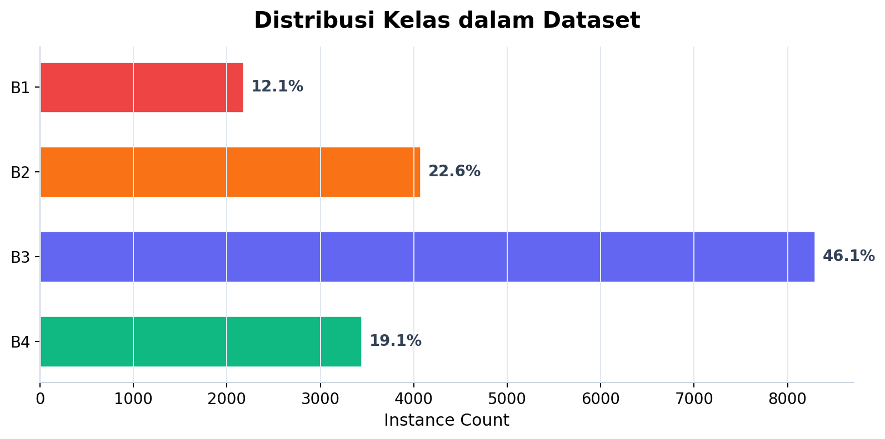

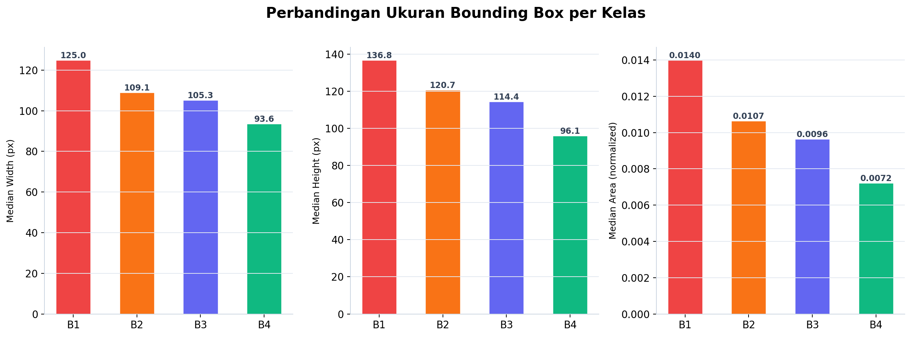

### 2. Resolution Sweep

Pertanyaan ini penting karena resolusi langsung mempengaruhi dua hal: kemampuan model mendeteksi objek kecil (terutama B4), dan biaya komputasi per run. Kita membandingkan 640 vs 1024 pada model yolo11n dengan 2 seed.

| imgsz | seed | mAP50 | mAP50-95 | precision | recall |
|---:|---:|---:|---:|---:|---:|
| 640 | 1 | 0.5237 | 0.2538 | 0.4906 | 0.5864 |
| 1024 | 1 | 0.5363 | 0.2571 | 0.4888 | 0.6016 |
| 640 | 2 | 0.5245 | 0.2514 | 0.4923 | 0.5838 |
| 1024 | 2 | 0.5276 | 0.2589 | 0.4952 | 0.6004 |

**Mean per resolusi:**
- `640`: mAP50 = 0.5241, mAP50-95 = 0.2526
- `1024`: mAP50 = 0.5320, mAP50-95 = 0.2580
- Relative gain 1024 vs 640 pada mAP50-95: **+2.15%**

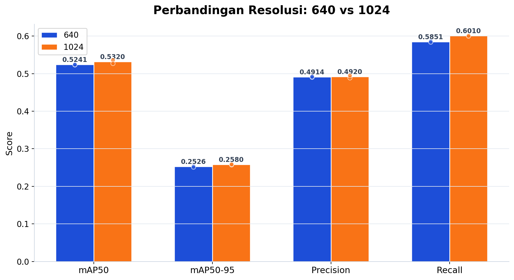

Gain 2.15% itu memang ada, tapi konteksnya perlu dilihat: setiap run di 1024 memakan hampir 2.5× lebih banyak VRAM dan waktu training dibanding 640. Dalam pipeline E0 yang menjalankan puluhan run (benchmark 11 arsitektur × 2 seed, tuning sweeps, dsb.), pilihan 1024 akan menggandakan total compute budget tanpa jaminan bahwa gain kecil ini akan bertahan saat arsitektur dan hyperparameter berubah.

Sesuai aturan di [E0.md](E0.md), gain 2-5% tidak otomatis mengunci resolusi yang lebih tinggi — keputusan harus mempertimbangkan efisiensi keseluruhan pipeline. Karena itu, **resolusi kerja di-lock pada 640** dan dibawa ke semua fase selanjutnya.

### 3. Learning Curve

Learning curve dijalankan untuk melihat apakah volume data saat ini sudah cukup, atau menambah data masih bisa memberikan gain yang signifikan.

| Fraction | mAP50 | mAP50-95 | Precision | Recall |
|---:|---:|---:|---:|---:|
| 25% | 0.4444 | 0.1984 | 0.4187 | 0.5758 |
| 50% | 0.4637 | 0.2202 | 0.4410 | 0.5791 |
| 75% | 0.5033 | 0.2444 | 0.4683 | 0.5906 |
| 100% | 0.5237 | 0.2538 | 0.4906 | 0.5864 |

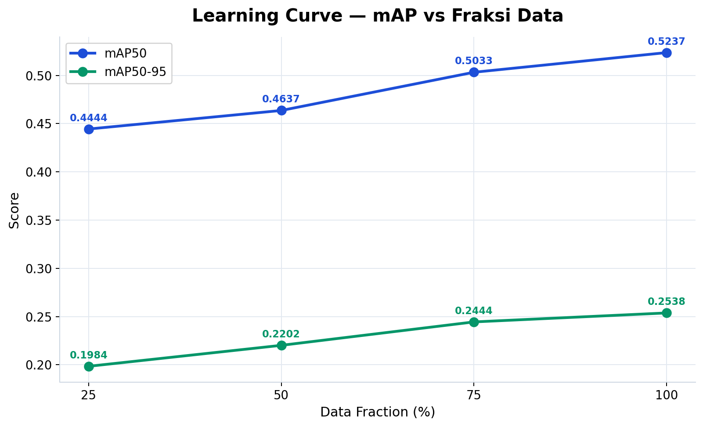

Kenaikan mAP50-95 antar step:
- 25% → 50%: **+0.0217**
- 50% → 75%: **+0.0243**
- 75% → 100%: **+0.0093**

Dari 25% ke 75%, gain per step relatif konsisten (~0.02). Tapi dari 75% ke 100%, gain tiba-tiba mengecil ke kurang dari setengahnya — ini menunjukkan awal dari diminishing returns. Kurva belum plateau, jadi menambah data berkualitas terutama untuk kelas underrepresented (B1, B4) kemungkinan masih membantu. Tapi menambah data secara acak tanpa memperhatikan distribusi kelas akan memberi diminishing returns yang semakin kecil.

### 4. Phase 0 Decisions

1. **Dataset cukup bersih untuk baseline.** Tidak ada leakage, tidak ada label invalid, split sudah terisolasi dengan benar.

2. **Resolusi kerja = 640.** Gain dari 1024 terlalu kecil (2.15%) relatif terhadap peningkatan compute cost. Di skala pipeline E0 dengan puluhan run, 640 adalah pilihan yang paling realistis.

3. **Data belum saturasi, tapi diminishing returns sudah mulai terlihat.** Menambah data secara targeted (bukan random) masih bisa membantu, terutama untuk kelas B1 dan B4 yang underrepresented.

---

## Phase 1 — Pipeline Decision + Architecture Sweep

Phase 1 menjawab dua pertanyaan besar: pipeline mana yang paling realistis untuk task 4-kelas ini (one-stage vs two-stage), dan arsitektur mana yang paling stabil di pipeline yang menang. Keduanya dijalankan dalam kondisi terkontrol — resolusi, batch, augmentation, dan seed sudah di-lock dari Phase 0.

### Data Sources

- [one_stage_results.csv](outputs/phase1/one_stage_results.csv) — hasil one-stage baseline
- [two_stage_results.csv](outputs/phase1/two_stage_results.csv) — hasil two-stage per komponen
- [architecture_benchmark.csv](outputs/phase1/architecture_benchmark.csv) — benchmark 11 arsitektur
- [phase1b_top3.csv](outputs/phase1/phase1b_top3.csv) — top-3 model
- [locked_setup.yaml](outputs/phase1/locked_setup.yaml) — lock file Phase 1

### 1. Phase 0 Inputs

Phase 1 membawa dua lock dari Phase 0:
- Resolusi kerja: **640**
- Dataset aktif: [Dataset-YOLO/data.yaml](Dataset-YOLO/data.yaml)

Semua perbandingan di Phase 1 menggunakan konfigurasi yang identik supaya hasilnya apple-to-apple.

### 2. Phase 1A — Pipeline Decision

#### One-stage baseline

Dari [one_stage_results.csv](outputs/phase1/one_stage_results.csv), one-stage detector (yolo11n, 4-class) menghasilkan:

- Mean mAP50: **0.5241**
- Mean mAP50-95: **0.2526**
- Variance antar seed sangat kecil (±0.001)

#### Two-stage feasibility

Pada Phase 1, feasibility two-stage dievaluasi dengan menjalankan GT-crop classifier — classifier yang dijalankan pada ground-truth crops sebagai *upper bound* (kondisi ideal tanpa error detector). Hasilnya: classifier kesulitan memisahkan kelas B2 dan B4 bahkan pada kondisi ideal ini, yang mengindikasikan bahwa pipeline end-to-end akan lebih buruk lagi karena error detector dan classifier terakumulasi.

> Keputusan ini dikonfirmasi kembali oleh benchmark Phase 3 end-to-end — lihat [§ Phase 3.2](#2-two-stage-results) untuk angka final.

#### Kenapa two-stage tidak dipilih

Pada evaluasi **GT-crop classifier** `last/test`, confusion matrix penuhnya adalah:

**Cara membaca:** Setiap **baris** = kelas yang sebenarnya (ground truth). Setiap **kolom** = kelas yang diprediksi model. **Diagonal** (sel yang sejajar) = prediksi benar. Angka di luar diagonal = kesalahan. Persentase dihitung per baris (dari total instance kelas tersebut).

| Ground truth \\ Prediksi | B1 | B2 | B3 | B4 | Total |
|---|---:|---:|---:|---:|---:|
| **B1** | **297 (88.4%)** | 36 (10.7%) | 3 (0.9%) | 0 (0.0%) | 336 |
| **B2** | 57 (9.2%) | **251 (40.6%)** | 306 (49.5%) | 4 (0.6%) | 618 |
| **B3** | 2 (0.1%) | 152 (11.3%) | **1,072 (79.8%)** | 117 (8.7%) | 1,343 |
| **B4** | 1 (0.2%) | 15 (2.8%) | 306 (56.1%) | **223 (40.9%)** | 545 |

Contoh baca baris B2: dari 618 buah B2 di ground truth, model benar 251 kali (40.6%), tapi 306 kali (49.5%) salah diprediksi sebagai B3.

| Kelas | Benar | Total | Accuracy |
|---|---:|---:|---:|
| B1 | 297 | 336 | **88.4%** |
| B3 | 1,072 | 1,343 | **79.8%** |
| B4 | 223 | 545 | **40.9%** |
| B2 | 251 | 618 | **40.6%** |
| **Overall** | **1,843** | **2,842** | **64.85%** |

Overall 64.85% terkesan lumayan, tapi angka ini didominasi B3 yang punya 1,343 instance (47% dari total) — B2 dan B4 yang hanya ~40% benar "tenggelam" dalam rata-rata.

- **B1 aman** — 88.4% benar, mudah dikenali karena warna merah dan ukuran besar yang distinctive
- **B2 paling buruk** — hanya 40.6% benar; hampir setengahnya (49.5%) salah dikira B3 karena transisi warna yang ambigu
- **B3 cukup baik** — 79.8% benar, wajar karena B3 mendominasi dataset (46%)
- **B4 kritis** — hanya 40.9% benar; 56.1% salah dikira B3 karena buah B4 kecil dan tersembunyi

Alasan utama: pemisahan kelas sulitnya masih lemah bahkan pada crop ground truth (kondisi ideal tanpa error detector). Pada jalur end-to-end, error detector menambah noise di atas ini, memperparah hasil akhir. One-stage tetap lebih layak sebagai pipeline utama.

> **Keputusan: pipeline `one-stage`.**

### 3. Phase 1B — Architecture Benchmark

Setelah pipeline di-lock, 11 arsitektur YOLO di-benchmark dalam kondisi identik: resolusi 640, `lr0=0.001`, `batch=16`, augmentasi medium, 2 seed per model.

#### Ranking lengkap

#### Top-3

| Rank | Model | Mean mAP50 | Mean mAP50-95 | Mean B4 Recall |
|---:|---|---:|---:|---:|
| 1 | `yolo11m.pt` | 0.5298 | 0.2570 | 0.367 |
| 2 | `yolov9c.pt` | 0.5292 | 0.2518 | 0.352 |
| 3 | `yolov8s.pt` | 0.5256 | 0.2521 | 0.411 |

**Gap antar model teratas sangat kecil.** Selisih yolo11m dan yolov9c hanya 0.0006 mAP50 — nyaris dalam margin of error. Bottleneck performa bukan di pilihan arsitektur, tapi di task difficulty dan data quality.

**yolov8s punya B4 recall tertinggi** (0.411) meskipun overall mAP50-nya lebih rendah. Model lebih kecil kadang lebih baik mendeteksi objek kecil karena feature map-nya tidak terlalu ter-downsample.

#### Per-class heatmap

Pola yang muncul sangat konsisten: B1 selalu tinggi, B4 selalu rendah, terlepas dari model yang dipakai. Difficulty ranking antar kelas — B1 > B3 > B2 > B4 — adalah sifat inherent dari task dan dataset.

#### Gate canonical dan override

- Gate canonical `mAP50 >= 0.70`: **False** — tidak ada model yang melewati threshold ini
- Local override continue: **True**

Override operasional agar pipeline end-to-end tetap berjalan sampai Phase 3 — keputusan ini disengaja untuk menghasilkan satu baseline lengkap yang bisa dijadikan referensi.

### 4. Phase 1 Decisions

1. **Pipeline: `one-stage`** — two-stage gagal menunjukkan keunggulan, bahkan di kondisi ideal (GT crops)
2. **Model: `yolo11m.pt`** — menang tipis tapi konsisten; bottleneck bukan di arsitektur

Lock ini artinya Phase 2 tidak membuka architecture search baru — hanya melakukan hyperparameter tuning pada satu model yang sudah dipilih.

---

## Phase 2 — Hyperparameter Optimization

Phase 2 menguji apakah penyesuaian hyperparameter bisa mendorong performa melewati ceiling yang terlihat di Phase 1. Tuning dilakukan secara sequential pada `yolo11m.pt`, mencakup loss function, learning rate, batch size, dan augmentation profile.

Secara singkat: **tuning tidak menghasilkan perbaikan yang meyakinkan**. Kombinasi terbaik hanya memberikan gain ~0.5% mAP50 dibanding baseline Phase 1B. Keputusan akhir: **revert ke baseline Phase 1B**.

### 1. Scope

| Aspek | Detail |
|---|---|
| Model | `yolo11m.pt` saja (tidak ada architecture search) |
| Input lock | [locked_setup.yaml](outputs/phase1/locked_setup.yaml) |
| Metrik fokus | mAP50, mAP50-95, B4 recall |
| Resolusi | `imgsz=640` (locked dari Phase 0) |
| Training | `epochs=30`, `patience=10`, `min_epochs=30` |
| Agregasi | mean dari 2 seed per opsi sweep |

Baseline Phase 1B untuk `yolo11m`: mean mAP50 **0.5298**, mean mAP50-95 **0.2570**, mean B4 recall **0.3673**.

### 2. Data Sources

- [imbalance_sweep.csv](outputs/phase2/imbalance_sweep.csv) — loss function sweep
- [lr_sweep.csv](outputs/phase2/lr_sweep.csv) — learning rate sweep
- [batch_sweep.csv](outputs/phase2/batch_sweep.csv) — batch size sweep
- [aug_sweep.csv](outputs/phase2/aug_sweep.csv) — augmentation profile sweep
- [tuning_results.csv](outputs/phase2/tuning_results.csv) — ringkasan keputusan tuning
- [p2confirm_yolo11m_640_s3_e30p10m30_eval.json](outputs/phase2/p2confirm_yolo11m_640_s3_e30p10m30_eval.json) — confirmation run
- [final_hparams.yaml](outputs/phase2/final_hparams.yaml) — konfigurasi final

### 3. Sweep Results

Beberapa cabang sweep dipangkas karena bukti awal sudah cukup jelas:
- **Step 0a (loss function)** — Tiga strategi (`none`, `class_weighted`, `focal15`) menghasilkan metrik identik → dikunci ke `none`
- **Step 0b (ordinal)** — Dilewati
- **Step 1 (LR)** — Baseline `lr0=0.001` di-reuse dari Phase 1B
- **Step 2 (batch)** — Hanya `8` vs `16`; `batch=32` dilewati
- **Step 3 (augmentasi)** — Hanya `light` vs `medium`; `heavy` dilewati

#### Step 0a — Loss function

| Strategi | Mean mAP50 | Mean mAP50-95 | Mean B4 Recall |
|---|---:|---:|---:|
| `none` | 0.5298 | 0.2570 | 0.3673 |
| `class_weighted` | 0.5298 | 0.2570 | 0.3673 |
| `focal15` | 0.5298 | 0.2570 | 0.3673 |

Ketiga strategi loss menghasilkan angka **identik** sampai 4 desimal. Loss function bukan bottleneck — **ceiling performa ditentukan oleh data dan task difficulty, bukan training objective**.

#### Step 1 — Learning rate

| LR | Source | Mean mAP50 | Mean mAP50-95 | Mean B4 Recall |
|---|---|---:|---:|---:|
| `0.001` | Phase 1B (reuse) | 0.5298 | 0.2570 | 0.3673 |
| `0.0005` | Sweep Phase 2 | 0.5350 | 0.2577 | 0.3637 |
| `0.002` | Sweep Phase 2 | 0.5338 | 0.2587 | 0.3337 |

`lr0=0.002` menjatuhkan B4 recall ke 0.334 — penurunan signifikan untuk kelas yang sudah paling sulit. `lr0=0.0005` sedikit lebih baik secara agregat tapi gain-nya marginal dan tidak konsisten antar seed.

#### Step 2 — Batch size

| Batch | Mean mAP50 | Mean mAP50-95 | Mean B4 Recall |
|---:|---:|---:|---:|
| 8 | 0.5321 | 0.2574 | 0.3791 |
| 16 | 0.5350 | 0.2577 | 0.3637 |

#### Step 3 — Augmentation profile

| Profile | Mean mAP50 | Mean mAP50-95 | Mean B4 Recall |
|---|---:|---:|---:|
| `light` | 0.5256 | 0.2512 | 0.3827 |
| `medium` | 0.5350 | 0.2577 | 0.3637 |

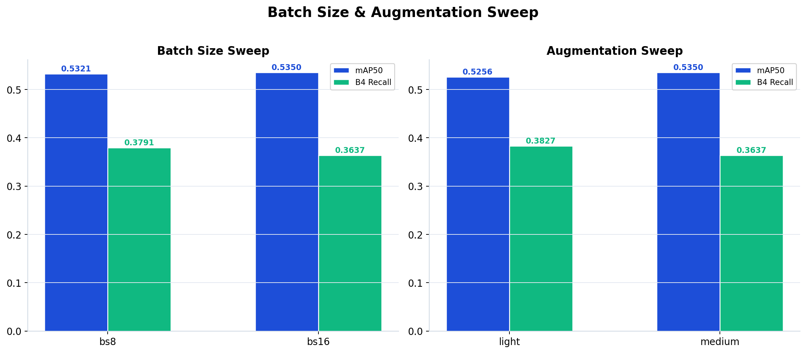

Konfigurasi "lebih ringan" (batch kecil, augmentasi ringan) cenderung lebih baik untuk B4 recall, sementara konfigurasi standar lebih baik untuk metrik agregat. Perbedaannya tetap kecil — tidak ada konfigurasi yang memberikan breakthrough.

### 4. Tuning Decision

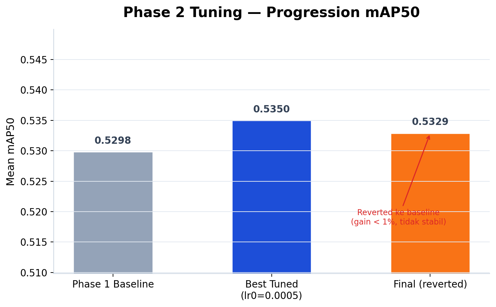

| Field | Nilai |
|---|---|
| Baseline mean mAP50 | 0.5298 |
| Best tuned mean mAP50 | 0.5350 |
| Delta | **+0.52%** |
| Reverted to Phase 1 baseline | **True** |
| Final source | `phase1_baseline_reverted` |

Selisih hanya **0.52%** — di bawah threshold meaningful, apalagi dengan variance antar seed yang masih overlap. Keputusan revert karena **gain tidak cukup untuk membenarkan perubahan recipe** yang sudah stabil dan reproducible.

### 5. Locked Configuration

| Parameter | Nilai |
|---|---|
| Model | `yolo11m.pt` |
| lr0 | `0.001` |
| Batch | `16` |
| Imbalance strategy | `none` |
| Ordinal strategy | `standard` |
| Aug profile | `medium` |
| Image size | `640` |
| Epochs | `30`, patience `10`, min_epochs `30` |

### 6. Confirmation Run

Run **`p2confirm_yolo11m_640_s3_e30p10m30`** menggunakan seed ke-3 untuk memvalidasi bahwa recipe terkunci menghasilkan performa yang konsisten. Evaluasi pada split **val**:

| Metrik | Nilai |
|---|---:|
| Precision | 0.5066 |
| Recall | 0.6042 |
| mAP50 | 0.5390 |
| mAP50-95 | 0.2594 |
| B4 recall | 0.3736 |
| `all_classes_ge_70_ap50` | **False** |

Per kelas (mAP50): B1 **0.8050**, B2 **0.4042**, B3 **0.5716**, B4 **0.3753**.

Gap antar kelas — B1 jauh di atas, B4 jauh di bawah — bukan artefak seed tertentu tapi karakteristik task ini.

### 7. Conclusions

1. **Loss function bukan bottleneck.** Tiga strategi menghasilkan metrik identik.
2. **LR, batch, dan augmentation memberikan trade-off marginal**, bukan perbaikan bersih.
3. **Revert ke baseline = pilihan stabilitas.** Gain < 1% tidak cukup kuat untuk membenarkan perubahan recipe.
4. **Bottleneck ada di task difficulty dan data quality.** Peningkatan berikutnya harus datang dari domain-specific augmentation, arsitektur yang lebih targeted, atau peningkatan kualitas/kuantitas data.

---

## Phase 3 — Final Validation Benchmark

### Overview

| Parameter | Nilai |
|---|---|
| Protocol source | [E0_Protocol_Flowchart.html](https://github.com/muhammad-zainal-muttaqin/YOLOBench/blob/main/E0_Protocol_Flowchart.html) |
| Training split | `train` only |
| Evaluation splits | `val` dan `test` |
| Primary checkpoint | `last.pt` (dengan `best.pt` juga dievaluasi) |
| One-stage candidates | `yolo11m.pt`, `yolov8s.pt` |
| Two-stage branch | Stage-1 single-class detector + Stage-2 GT-crop classifier + evaluasi end-to-end |

### 1. One-Stage Results

| Model | Ckpt | Val mAP50 | Test mAP50 | Val Recall | Test Recall |
|---|---|---:|---:|---:|---:|
| `yolo11m` | `last` | 0.4996 | 0.4840 | 0.5630 | 0.5563 |
| `yolo11m` | `best` | 0.5372 | 0.5019 | 0.6003 | 0.5911 |
| `yolov8s` | `last` | 0.4776 | 0.4621 | 0.5352 | 0.5431 |
| `yolov8s` | `best` | 0.5244 | 0.5063 | 0.5835 | 0.5813 |

> Tabel ini adalah ringkasan navigasi cepat. Detail lengkap termasuk W-F1 dan perbandingan exhaustive semua kombinasi model×checkpoint×split ada di [§4 Final Metrics](#4-final-metrics).

### 2. Two-Stage Results

| Branch | Model | Ckpt | Split | Precision | Recall | F1 / Top-1 |
|---|---|---|---|---:|---:|---:|
| Stage-1 detector | `yolo11n` | `last` | test | 0.8064 | 0.7329 | mAP50 **0.8130** |
| GT-crop classifier | `yolo11n-cls` | `last` | test | 0.6432 | 0.6485 | W-F1 **0.6337** |
| End-to-end | detector+classifier | `last` | test | 0.4840 | 0.5053 | W-F1 **0.4802** |

> GT-crop classifier adalah **upper bound** — classifier dijalankan pada ground truth crops, bukan output detector. Hasil operasional yang relevan adalah jalur **end-to-end**.

### 3. Figures

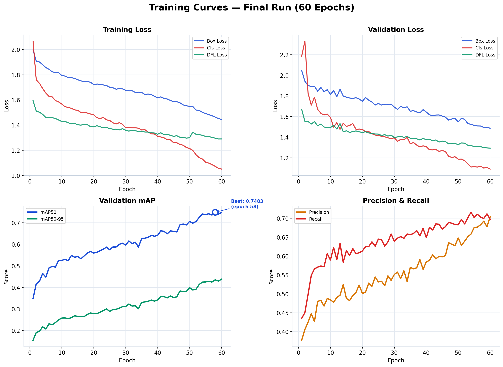

*Kedua model konvergen tanpa overfitting signifikan; val loss sejajar training loss hingga epoch akhir.*

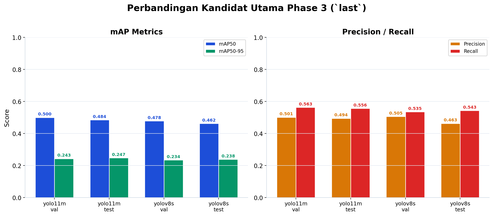

*Perbandingan mAP50 lintas Phase 0–3 — performa plateau sejak Phase 1B; tuning Phase 2 tidak menggeser baseline.*

*Best checkpoint unggul ~1.5pp mAP50 dibanding last pada val, tapi gap menyempit di test — menunjukkan slight overfitting pada val.*

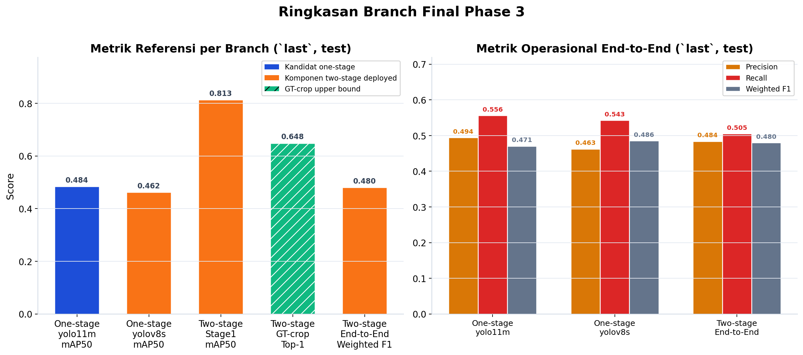

*Ringkasan arsitektur dua branch: one-stage (4-class) vs two-stage (single-class detector + crop classifier).*

*B1 AP50 jauh di atas (~0.80), B4 paling rendah (~0.35) — konsisten di semua model dan checkpoint.*

*Sweep confidence threshold 0.1–0.9; threshold default 0.25 memberikan trade-off precision/recall yang paling seimbang.*

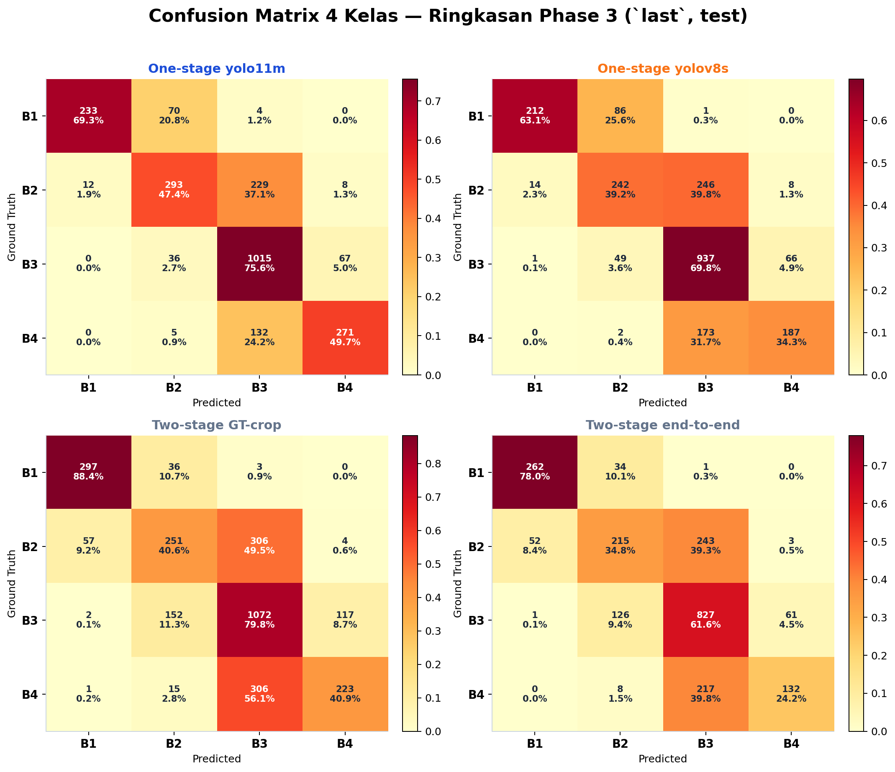

*Konfusi terbesar terjadi pada pasangan B2↔B3 dan B3↔B4 — sesuai kedekatan biologis tahap kematangan adjacent.*

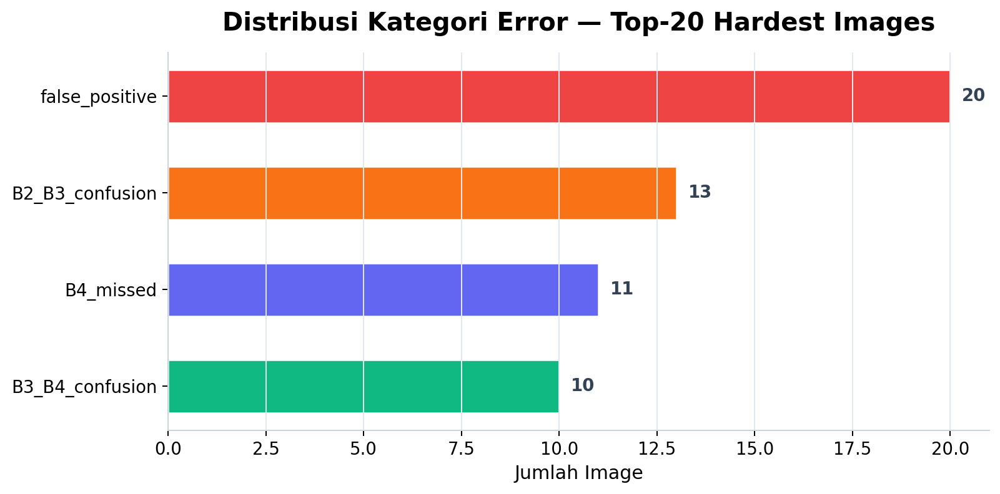

*FP tersebar merata di semua model (plateau di 20), menunjukkan perilaku threshold sistematis bukan kegagalan model-spesifik.*

### 4. Final Metrics

#### One-Stage Candidates

| Model | Ckpt | Split | Precision | Recall | mAP50 | W-F1 |
|---|---|---|---:|---:|---:|---:|
| `yolo11m` | `best` | test | 0.4941 | 0.5911 | 0.5019 | 0.4686 |
| `yolo11m` | `best` | val  | 0.5161 | 0.6003 | 0.5372 | 0.4737 |
| `yolo11m` | `last` | test | 0.4944 | 0.5563 | 0.4840 | 0.4705 |
| `yolo11m` | `last` | val  | 0.5011 | 0.5630 | 0.4996 | 0.4737 |
| `yolov8s` | `best` | test | 0.4968 | 0.5813 | 0.5063 | 0.4606 |
| `yolov8s` | `best` | val  | 0.4965 | 0.5835 | 0.5244 | 0.4636 |
| `yolov8s` | `last` | test | 0.4626 | 0.5431 | 0.4621 | 0.4857 |
| `yolov8s` | `last` | val  | 0.5054 | 0.5352 | 0.4776 | 0.4917 |

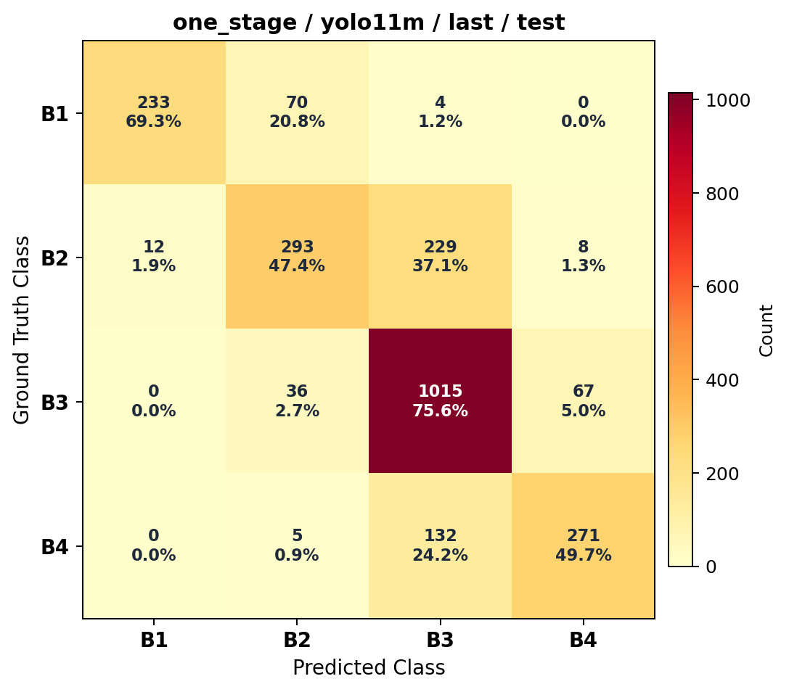

#### Per-Class AP50 — yolo11m, last, test (model final)

| Kelas | AP50 | Catatan |
|---|---:|---|
| B1 | **0.8050** | Tertinggi — buah matang, warna merah, distinctive |
| B2 | **0.4042** | Transisi, sering confused dengan B3 |
| B3 | **0.5716** | Dominan di dataset (46%), performa medium |
| B4 | **0.3753** | Terendah — bbox terkecil, paling teroklusi |

> Nilai dari confirmation run Phase 2 (val) sebagai proxy; nilai test final ada di [per_class_metrics.csv](outputs/phase3/per_class_metrics.csv).

#### Two-Stage End-to-End

| Detector+Classifier | Ckpt | Split | Precision | Recall | W-F1 |
|---|---|---|---:|---:|---:|
| `yolo11n_singlecls + yolo11ncls_gtcrop` | `best` | test | 0.4707 | 0.5123 | 0.4737 |
| `yolo11n_singlecls + yolo11ncls_gtcrop` | `best` | val  | 0.4730 | 0.5126 | 0.4731 |
| `yolo11n_singlecls + yolo11ncls_gtcrop` | `last` | test | 0.4840 | 0.5053 | 0.4802 |
| `yolo11n_singlecls + yolo11ncls_gtcrop` | `last` | val  | 0.4750 | 0.4874 | 0.4655 |

#### Two-Stage GT-Crop Classifier (Upper Bound) + Stage-1 Detector

| Branch | Model | Ckpt | Split | Precision | Recall | W-F1 |
|---|---|---|---|---:|---:|---:|
| GT-crop classifier | `yolo11n-cls` | `best` | test | 0.6449 | 0.6457 | 0.6254 |
| GT-crop classifier | `yolo11n-cls` | `best` | val  | 0.6392 | 0.6432 | 0.6223 |
| GT-crop classifier | `yolo11n-cls` | `last` | test | 0.6432 | 0.6485 | 0.6337 |
| GT-crop classifier | `yolo11n-cls` | `last` | val  | 0.6259 | 0.6339 | 0.6191 |
| Stage-1 detector   | `yolo11n`     | `best` | test | 0.8054 | 0.7399 | — |
| Stage-1 detector   | `yolo11n`     | `best` | val  | 0.8152 | 0.7441 | — |
| Stage-1 detector   | `yolo11n`     | `last` | test | 0.8064 | 0.7329 | — |
| Stage-1 detector   | `yolo11n`     | `last` | val  | 0.8089 | 0.7276 | — |

> GT-crop classifier metrics adalah **upper bound**. Hasil operasional yang relevan ada di tabel End-to-End di atas.

(Expand Here 👇)

All confusion matrices — yolo11m &amp; yolov8s × best/last × val/test

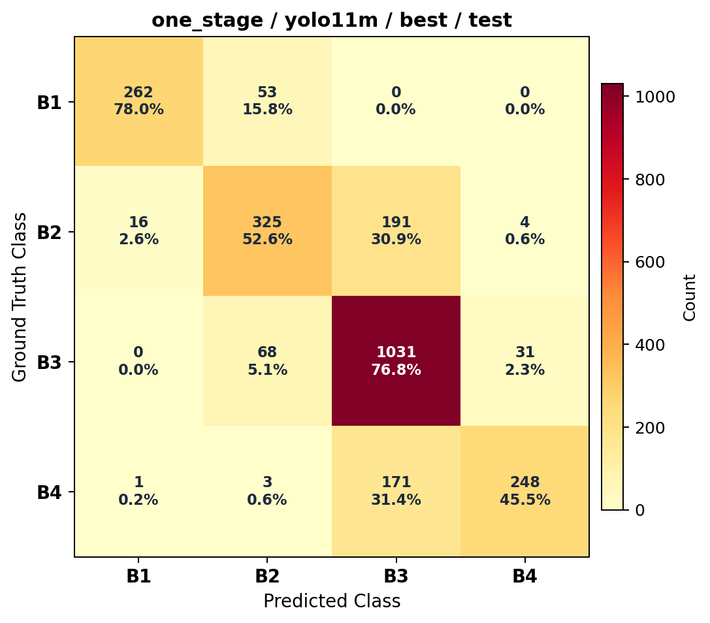

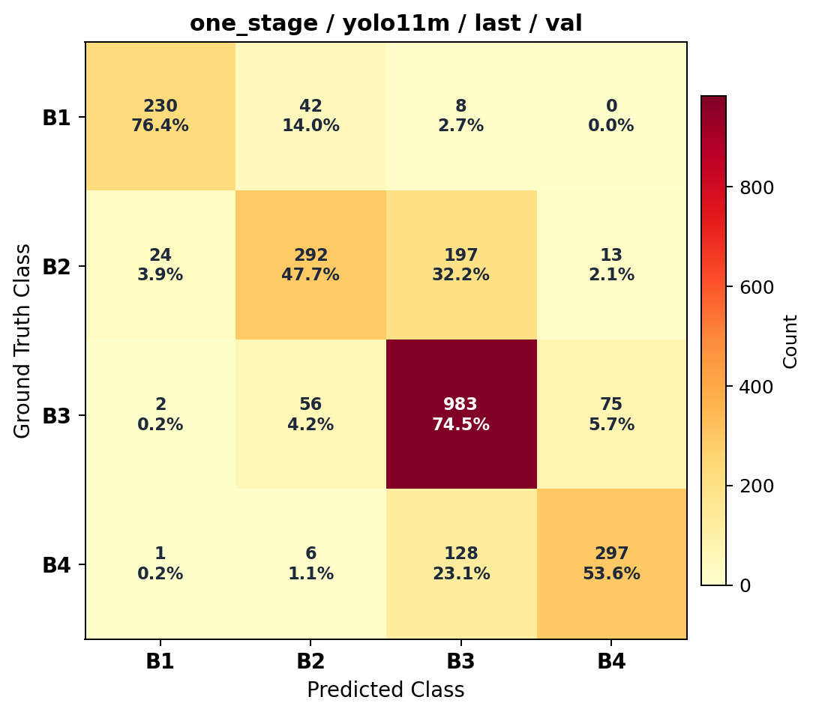

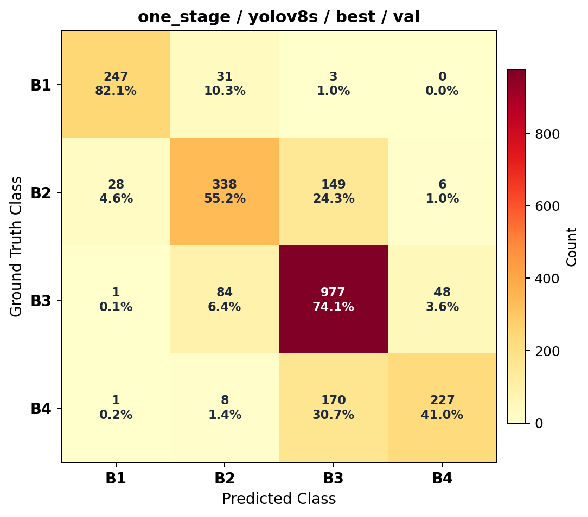

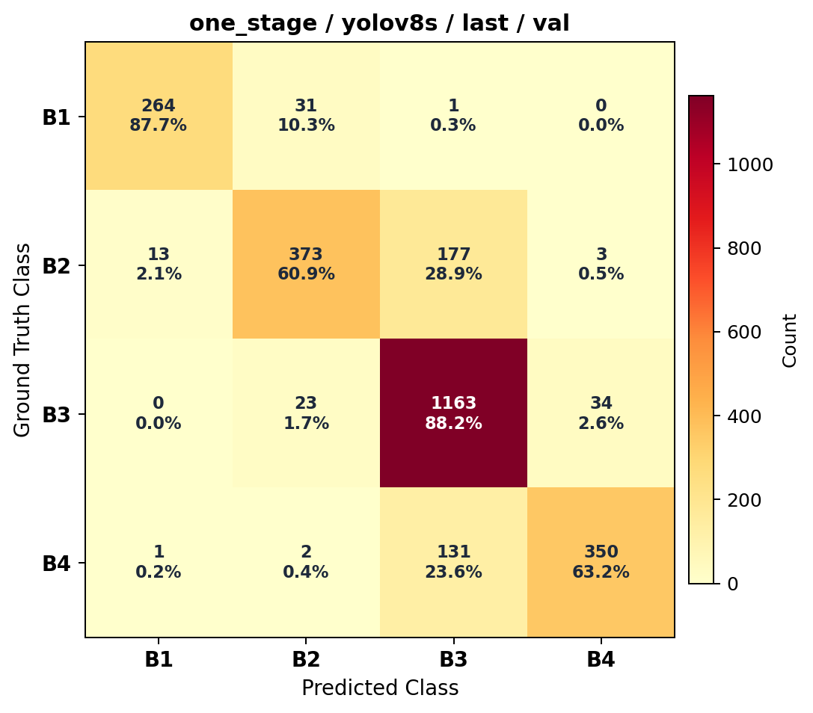

### 5. Error Analysis

Error stratification untuk kandidat one-stage pada test set (held-out split).

| Model | Ckpt | False Positives | B2↔B3 Confusion | B3↔B4 Confusion | B4 Missed |
|---|---|---:|---:|---:|---:|
| `yolo11m` | `best` | 20 | 15 | 14 | 9 |
| `yolo11m` | `last` | 20 | 14 | 11 | 6 |
| `yolov8s` | `best` | 20 | 11 | 12 | 11 |
| `yolov8s` | `last` | 20 | 12 | 15 | 13 |

False positive jenuh di 20 di semua model, menunjukkan perilaku threshold yang sistematis daripada kegagalan model-spesifik. Konfusi B2↔B3 dan B3↔B4 mencerminkan kedekatan biologis tahap kematangan yang berdekatan — batas visual antar kelas adjacent memang ambigu secara inheren. B4 missed paling rendah pada `yolo11m/last` (6 gambar), menjadikannya pilihan paling konservatif untuk deployment di mana B4 miss memiliki cost tinggi.

| Pipeline | Ckpt | False Positives | B2↔B3 Confusion | B3↔B4 Confusion | B4 Missed |
|---|---|---:|---:|---:|---:|
| Two-stage e2e | `best` | 20 | 17 | 16 | 10 |
| Two-stage e2e | `last` | 19 | 13 | 16 | 11 |

Two-stage end-to-end memiliki B2↔B3 confusion lebih tinggi (13–17) dibanding one-stage yolo11m (11–15), karena error dari detector dan classifier terakumulasi dalam satu pipeline.

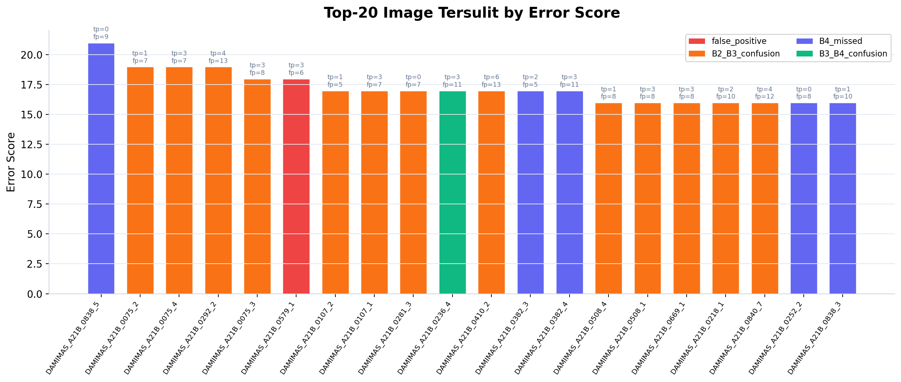

---

## Appendix

### A. Key Artifacts

**Phase 3 source of truth:**

- [final_metrics.csv](outputs/phase3/final_metrics.csv)
- [per_class_metrics.csv](outputs/phase3/per_class_metrics.csv)
- [confusion_matrix.csv](outputs/phase3/confusion_matrix.csv)
- [threshold_sweep.csv](outputs/phase3/threshold_sweep.csv)
- [error_stratification.csv](outputs/phase3/error_stratification.csv)
- [error_analysis.md](outputs/phase3/error_analysis.md)

**All phases:**

- [phase0_summary.md](outputs/phase0/phase0_summary.md)
- [phase1_summary.md](outputs/phase1/phase1_summary.md)
- [architecture_benchmark.csv](outputs/phase1/architecture_benchmark.csv)
- [per_class_metrics.csv](outputs/phase1/per_class_metrics.csv)
- [locked_setup.yaml](outputs/phase1/locked_setup.yaml)
- [phase2_summary.md](outputs/phase2/phase2_summary.md)
- [tuning_results.csv](outputs/phase2/tuning_results.csv)
- [final_hparams.yaml](outputs/phase2/final_hparams.yaml)
- [final_report.md](outputs/phase3/final_report.md)
- [final_evaluation.md](outputs/phase3/final_evaluation.md)
- [outputs/phase3/detail/](outputs/phase3/detail/)
- [outputs/phase3/figures/](outputs/phase3/figures/)
- [run_ledger.csv](outputs/reports/run_ledger.csv)
- [git_sync_log.md](outputs/reports/git_sync_log.md)

> [GUIDE.md](GUIDE.md) adalah runbook operasional. [CONTEXT.md](CONTEXT.md) memuat decision context dan caveat riset. [run_ledger.csv](outputs/reports/run_ledger.csv) adalah ledger utama semua run. Seluruh workflow diatur untuk menyimpan hasil, commit, lalu push.

### B. Model Weights Reference

Final weights dari Phase 3. Base path detect: `/workspace/brand-new-yolo/runs/detect/runs/e0/`; classify: `/workspace/brand-new-yolo/runs/classify/runs/e0/`.

| Run | Model | Size |
|---|---|---|
| `p3os_yolo11m_640_s42_e60fix` | yolo11m | 38.63 MB |
| `p3os_yolov8s_640_s42_e60fix` | yolov8s | 21.47 MB |
| `p3ts_stage1_singlecls_yolo11n_640_s42_e30p10m30` | yolo11n | 5.20 MB |
| `p3ts_stage2_cls_yolo11n-cls_224_s42_e30p10m30` | yolo11n-cls | 3.04 MB |

### C. Recent Weight Outputs

| Run | Model |
|---|---|
| `p2s3_light_yolo11m_640_s1_e30p10m30` | yolo11m |
| `p2s3_light_yolo11m_640_s2_e30p10m30` | yolo11m |
| `p2s3_medium_yolo11m_640_s1_e30p10m30` | yolo11m |
| `p2s3_medium_yolo11m_640_s2_e30p10m30` | yolo11m |
| `p2confirm_yolo11m_640_s3_e30p10m30` | yolo11m |
| `p3_final_yolo11m_640_s42_e60p15m60` | yolo11m |
| `p3os_yolo11m_640_s42_e60fix` | yolo11m |
| `p3os_yolov8s_640_s42_e60fix` | yolov8s |
| `p3ts_stage1_singlecls_yolo11n_640_s42_e30p10m30` | yolo11n |
| `p3ts_stage2_cls_yolo11n-cls_224_s42_e30p10m30` | yolo11n-cls |

Full workspace paths tersedia di [run_ledger.csv](outputs/reports/run_ledger.csv).

### D. Deploy Check Status

Detail lengkap di [deploy_check.md](outputs/phase3/deploy_check.md).

- Status: **deferred by repo override**
- TFLite export: `skipped for now`
- TFLite INT8 export: `skipped for now`
- Rationale: Phase 3 memprioritaskan benchmark adil, dokumentasi, dan sinkronisasi artefak sebelum deployment engineering.
- Penting: konversi deployment wajib divalidasi ulang terhadap artefak hasil konversi.
