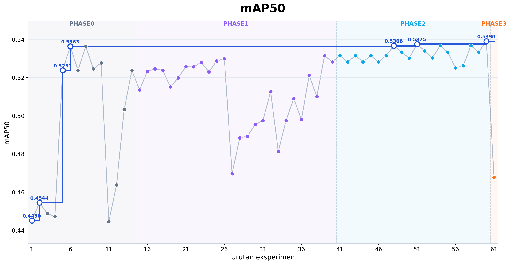
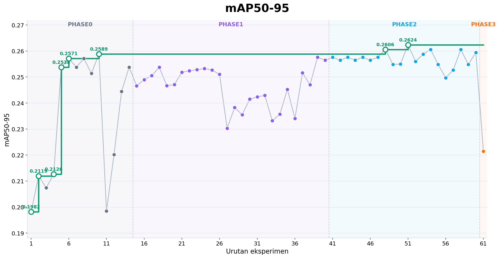
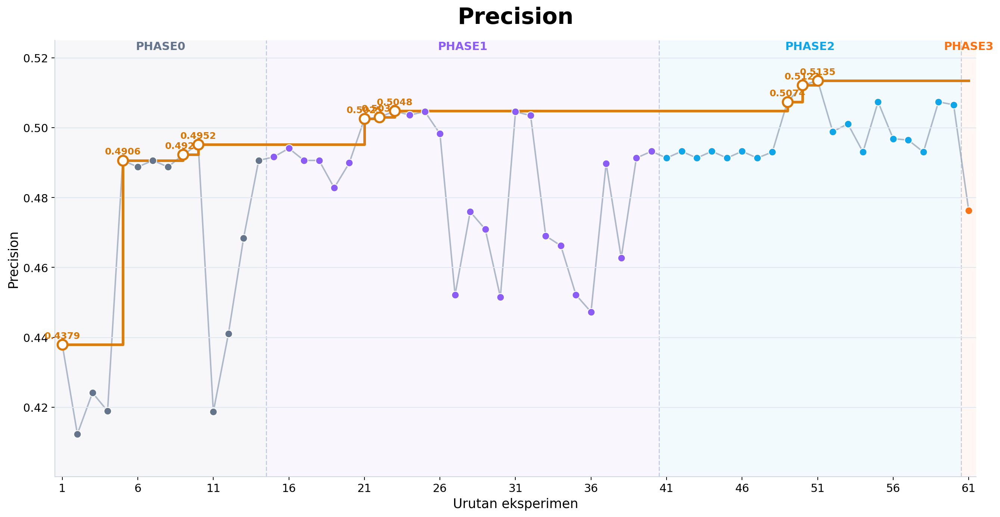
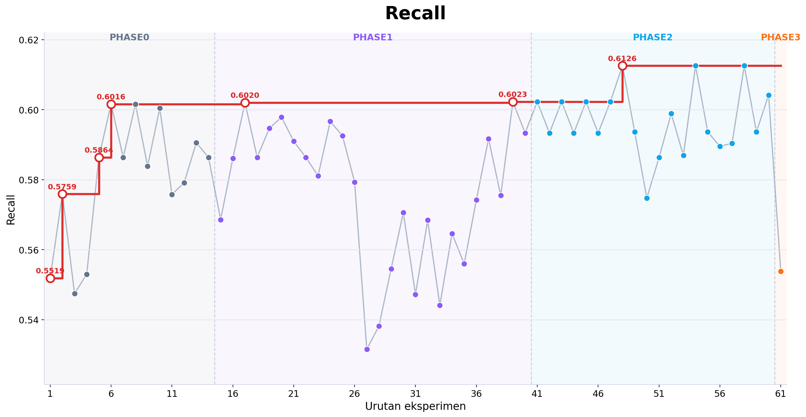

# Brand New YOLO — Peta Baca Repo

File ini adalah pintu masuk repo. Bukan untuk menceritakan semuanya, melainkan untuk menunjukkan **dokumen mana yang perlu dibuka**, **artefak mana yang jadi acuan**, dan **urutan baca yang aman**.

Untuk keputusan akhir lintas fase, buka [outputs/phase3/final_report.md](outputs/phase3/final_report.md). Untuk metrik teknis run final, buka [outputs/phase3/final_evaluation.md](outputs/phase3/final_evaluation.md).

## Ringkasan visual cepat

Kalau Anda ingin menangkap progres eksperimen E0 dalam sekali lihat, empat chart ini memisahkan tiap metrik supaya perubahan antar run lebih mudah dibaca. Komponen eksplorasinya ada di [yolo_e0_research_progress.jsx](yolo_e0_research_progress.jsx), sementara PNG README digenerate dari [outputs/reports/run_ledger.csv](outputs/reports/run_ledger.csv) lewat [scripts/generate_e0_research_progress_charts.py](scripts/generate_e0_research_progress_charts.py).

## Mulai dari sini

- Ringkasan akhir lintas fase: [outputs/phase3/final_report.md](outputs/phase3/final_report.md)
- Evaluasi teknis run final: [outputs/phase3/final_evaluation.md](outputs/phase3/final_evaluation.md)
- Checklist reproduksi dan terminasi RunPod: [outputs/reports/reproducibility_and_termination.md](outputs/reports/reproducibility_and_termination.md)
- Protokol canonical E0: [E0.md](E0.md)
- Runbook operasional repo ini: [GUIDE.md](GUIDE.md)
- Konteks keputusan riset: [CONTEXT.md](CONTEXT.md)
- Versi singkat konteks keputusan: [CONTEXT_Less.md](CONTEXT_Less.md)

## Hierarki acuan

Kalau ada konflik antar dokumen, ikuti urutan berikut:

1. Artefak run final yang melekat langsung ke run:
   - [outputs/phase3/p3_final_yolo11m_640_s42_e60p15m60_eval.json](outputs/phase3/p3_final_yolo11m_640_s42_e60p15m60_eval.json)
   - [outputs/phase3/p3_final_yolo11m_640_s42_e60p15m60_summary.json](outputs/phase3/p3_final_yolo11m_640_s42_e60p15m60_summary.json)
2. Lock file dan hyperparameter final:
   - [outputs/phase1/locked_setup.yaml](outputs/phase1/locked_setup.yaml)
   - [outputs/phase2/final_hparams.yaml](outputs/phase2/final_hparams.yaml)
3. Ringkasan per fase:
   - [outputs/phase0/phase0_summary.md](outputs/phase0/phase0_summary.md)
   - [outputs/phase1/phase1_summary.md](outputs/phase1/phase1_summary.md)
   - [outputs/phase2/phase2_summary.md](outputs/phase2/phase2_summary.md)
   - [outputs/phase3/final_report.md](outputs/phase3/final_report.md)
4. Dokumen konteks dan protokol:
   - [E0.md](E0.md)
   - [GUIDE.md](GUIDE.md)
   - [CONTEXT.md](CONTEXT.md)

## Arti label di repo ini

Repo ini memakai arti berikut secara konsisten:

- `B1`: buah **merah**, **besar**, **bulat**, posisi **paling bawah** pada tandan → **paling matang / ripe**
- `B2`: buah masih **hitam**, mulai **transisi ke merah**, sudah **besar** dan **bulat**, posisi **di atas B1**
- `B3`: buah **full hitam**, masih **berduri**, masih **lonjong**, posisi **di atas B2**
- `B4`: buah **paling kecil**, **paling dalam di tandan**, sulit terlihat, masih banyak **duri**, warna **hitam sampai hijau** → **paling belum matang**

Urutan biologisnya: **`B1 -> B2 -> B3 -> B4` = paling matang ke paling mentah**.

Mapping yang sama juga tertulis di:

- [E0.md](E0.md)
- [GUIDE.md](GUIDE.md)
- [CONTEXT.md](CONTEXT.md)
- [outputs/phase1/locked_setup.yaml](outputs/phase1/locked_setup.yaml)

## Keputusan akhir

Berikut keputusan yang dikunci sampai akhir:

- pipeline final: **one-stage**
- model final: **`yolo11m.pt`**
- resolusi kerja: **`640`**
- recipe final: **`lr0=0.001`, `batch=16`, `imbalance=none`, `ordinal=standard`, `aug=medium`**
- run final: **`p3_final_yolo11m_640_s42_e60p15m60`**
- weight final: [runs/detect/runs/e0/p3_final_yolo11m_640_s42_e60p15m60/weights/best.pt](runs/detect/runs/e0/p3_final_yolo11m_640_s42_e60p15m60/weights/best.pt)

Bukti langsung:

- [outputs/phase1/locked_setup.yaml](outputs/phase1/locked_setup.yaml)
- [outputs/phase2/final_hparams.yaml](outputs/phase2/final_hparams.yaml)
- [outputs/phase3/p3_final_yolo11m_640_s42_e60p15m60_summary.json](outputs/phase3/p3_final_yolo11m_640_s42_e60p15m60_summary.json)

## Angka resmi final

Ambil dari dua file run-specific berikut:

- [outputs/phase3/p3_final_yolo11m_640_s42_e60p15m60_eval.json](outputs/phase3/p3_final_yolo11m_640_s42_e60p15m60_eval.json)
- [outputs/phase3/p3_final_yolo11m_640_s42_e60p15m60_summary.json](outputs/phase3/p3_final_yolo11m_640_s42_e60p15m60_summary.json)

Nilai utama:

- precision: **0.4763**
- recall: **0.5538**
- mAP50: **0.4677**
- mAP50-95: **0.2215**
- all classes `AP50 >= 0.70`: **False**

## Ikhtisar keputusan per fase

| Fase | Keputusan inti | File yang harus dibuka |
|---|---|---|
| Phase 0 | Dataset valid. Resolusi kerja dipilih `640`. | [outputs/phase0/dataset_audit.json](outputs/phase0/dataset_audit.json), [outputs/phase0/eda_report.md](outputs/phase0/eda_report.md), [outputs/phase0/phase0_summary.md](outputs/phase0/phase0_summary.md) |
| Phase 1A | Pipeline **one-stage** dipilih. | [outputs/phase1/one_stage_results.csv](outputs/phase1/one_stage_results.csv), [outputs/phase1/two_stage_results.csv](outputs/phase1/two_stage_results.csv), [outputs/phase1/phase1_summary.md](outputs/phase1/phase1_summary.md) |
| Phase 1B | Model terbaik yang di-lock adalah `yolo11m.pt`. | [outputs/phase1/architecture_benchmark.csv](outputs/phase1/architecture_benchmark.csv), [outputs/phase1/phase1b_top3.csv](outputs/phase1/phase1b_top3.csv), [outputs/phase1/locked_setup.yaml](outputs/phase1/locked_setup.yaml) |
| Phase 2 | Tuning tidak memberi lompatan berarti. Repo kembali ke baseline stabil. | [outputs/phase2/tuning_results.csv](outputs/phase2/tuning_results.csv), [outputs/phase2/phase2_summary.md](outputs/phase2/phase2_summary.md), [outputs/phase2/final_hparams.yaml](outputs/phase2/final_hparams.yaml) |
| Phase 3 | Final retrain selesai. Weight final aman. Deploy check ditunda. | [outputs/phase3/final_report.md](outputs/phase3/final_report.md), [outputs/phase3/final_evaluation.md](outputs/phase3/final_evaluation.md), [outputs/phase3/deploy_check.md](outputs/phase3/deploy_check.md) |

## Urutan baca yang disarankan

1. [README.md](README.md) — peta besar.
2. [outputs/phase3/final_report.md](outputs/phase3/final_report.md) — narasi keputusan Phase 0 sampai Phase 3.
3. [outputs/phase3/final_evaluation.md](outputs/phase3/final_evaluation.md) — evaluasi teknis run final.
4. Kalau perlu audit per fase, buka berurutan:
   - [outputs/phase0/phase0_summary.md](outputs/phase0/phase0_summary.md)
   - [outputs/phase1/phase1_summary.md](outputs/phase1/phase1_summary.md)
   - [outputs/phase2/phase2_summary.md](outputs/phase2/phase2_summary.md)
5. Kalau perlu audit run dan sinkronisasi artefak:
   - [outputs/reports/run_ledger.csv](outputs/reports/run_ledger.csv)
   - [outputs/reports/git_sync_log.md](outputs/reports/git_sync_log.md)
   - [outputs/reports/latest_status.md](outputs/reports/latest_status.md)

## Artefak yang sering dirujuk

- Audit dataset: [outputs/phase0/dataset_audit.json](outputs/phase0/dataset_audit.json)
- Ringkasan Phase 0: [outputs/phase0/phase0_summary.md](outputs/phase0/phase0_summary.md)
- Benchmark arsitektur: [outputs/phase1/architecture_benchmark.csv](outputs/phase1/architecture_benchmark.csv)
- Top-3 Phase 1B: [outputs/phase1/phase1b_top3.csv](outputs/phase1/phase1b_top3.csv)
- Lock setup: [outputs/phase1/locked_setup.yaml](outputs/phase1/locked_setup.yaml)
- Ringkasan tuning: [outputs/phase2/phase2_summary.md](outputs/phase2/phase2_summary.md)
- Hyperparameter final: [outputs/phase2/final_hparams.yaml](outputs/phase2/final_hparams.yaml)
- Evaluasi run final: [outputs/phase3/p3_final_yolo11m_640_s42_e60p15m60_eval.json](outputs/phase3/p3_final_yolo11m_640_s42_e60p15m60_eval.json)
- Metadata run final: [outputs/phase3/p3_final_yolo11m_640_s42_e60p15m60_summary.json](outputs/phase3/p3_final_yolo11m_640_s42_e60p15m60_summary.json)
- Analisis error: [outputs/phase3/error_analysis.md](outputs/phase3/error_analysis.md)
- Threshold sweep: [outputs/phase3/threshold_sweep.csv](outputs/phase3/threshold_sweep.csv)
- Final report: [outputs/phase3/final_report.md](outputs/phase3/final_report.md)
- Final evaluation: [outputs/phase3/final_evaluation.md](outputs/phase3/final_evaluation.md)
- Weight final: [runs/detect/runs/e0/p3_final_yolo11m_640_s42_e60p15m60/weights/best.pt](runs/detect/runs/e0/p3_final_yolo11m_640_s42_e60p15m60/weights/best.pt)

## Audit trail

- Ledger seluruh run: [outputs/reports/run_ledger.csv](outputs/reports/run_ledger.csv)
- Status eksekusi terbaru: [outputs/reports/latest_status.md](outputs/reports/latest_status.md)
- Log sinkronisasi Git: [outputs/reports/git_sync_log.md](outputs/reports/git_sync_log.md)
- Snapshot reproduksi dan terminasi: [outputs/reports/reproducibility_and_termination.md](outputs/reports/reproducibility_and_termination.md)
- State orchestrator: [outputs/reports/master_state.json](outputs/reports/master_state.json)
