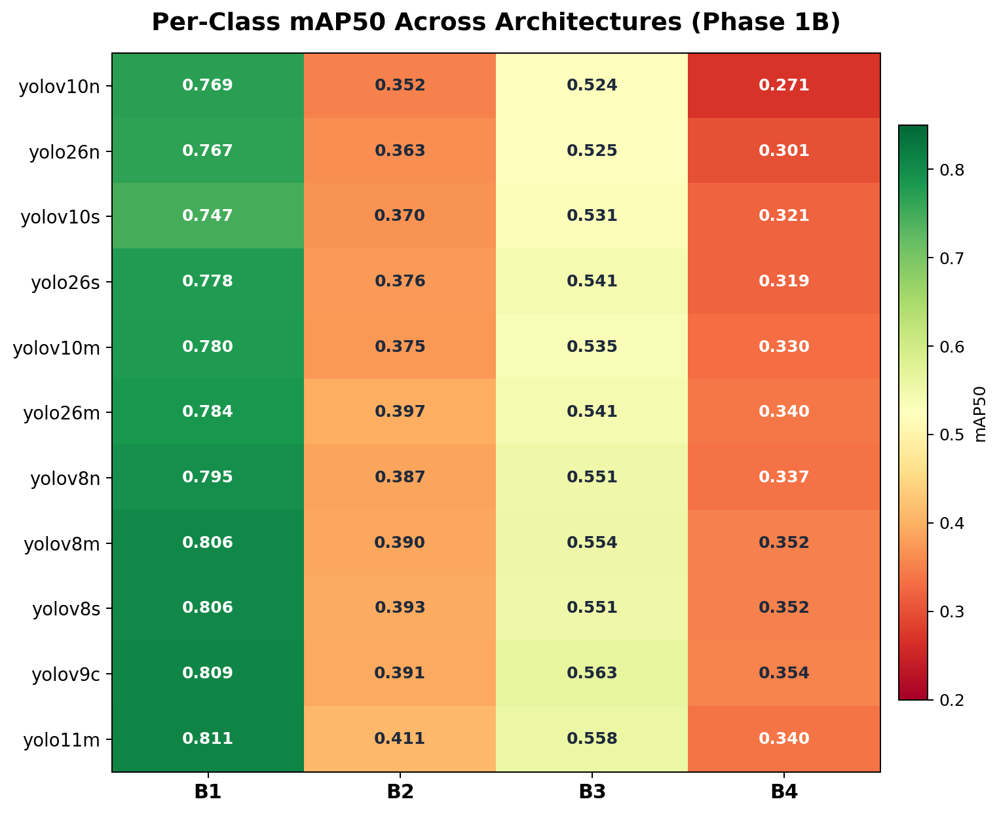
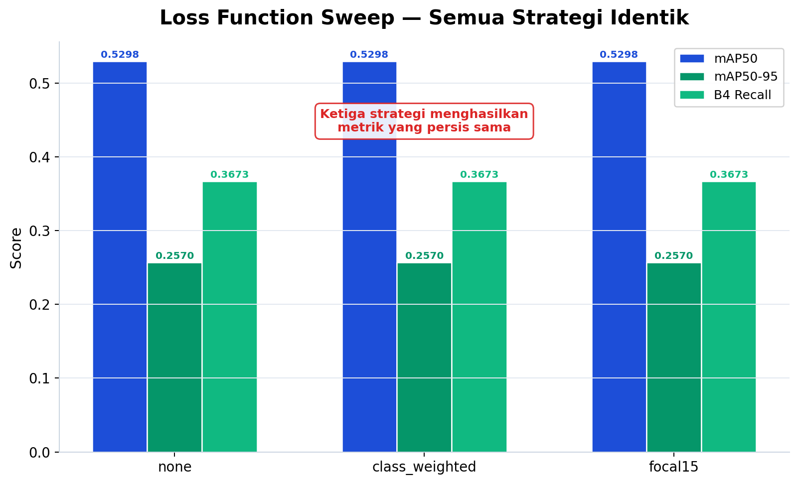
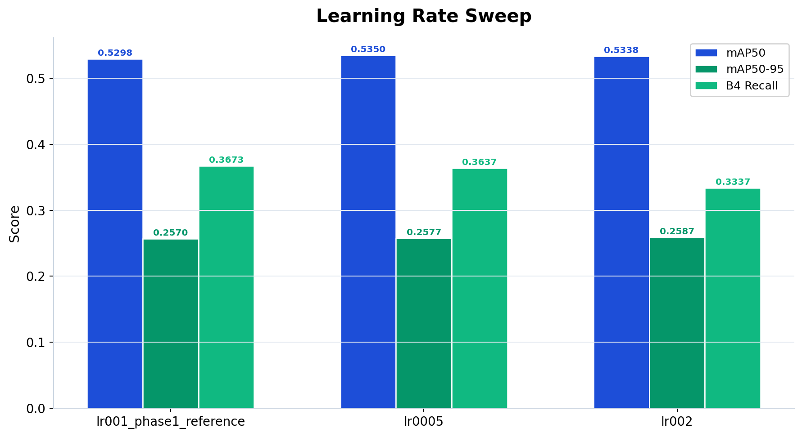
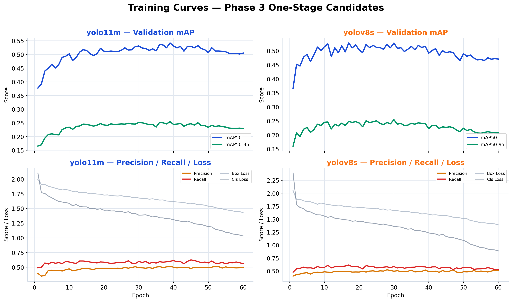
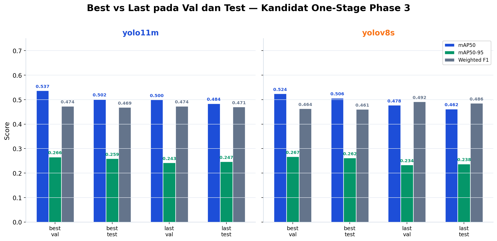
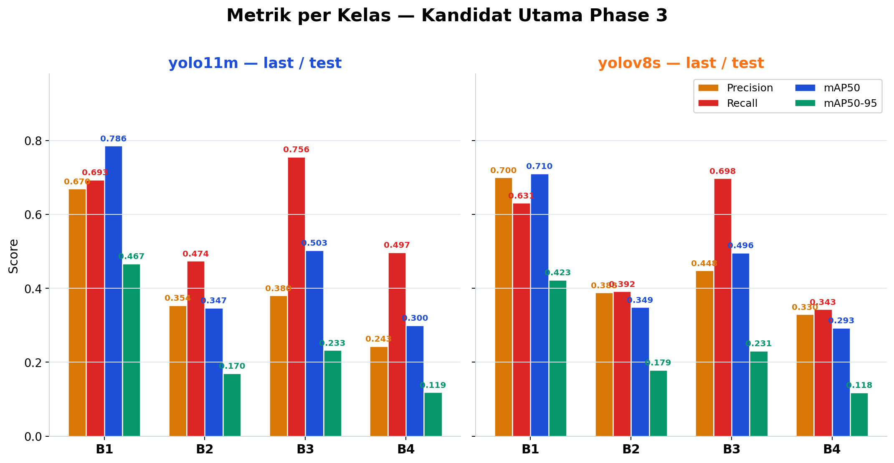
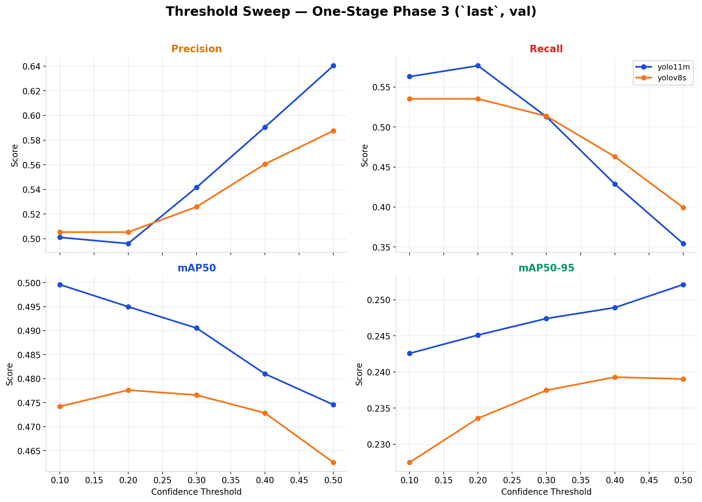
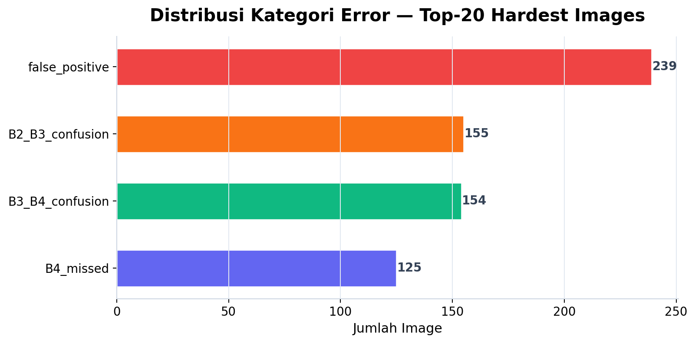

# Brand New YOLO — E0 End-to-End Report

Repositori ini memuat eksekusi **E0 Baseline Experimental Protocol** untuk task deteksi tingkat kematangan tandan buah sawit 4 kelas pada dataset aktif repo ini.

## Canonical Protocol Source
- `E0.md`
- `https://github.com/muhammad-zainal-muttaqin/YOLOBench/blob/main/E0_Protocol_Flowchart.html`

## Root Semantic Mapping Used in This Repo
- `B1`: buah **merah**, **besar**, **bulat**, posisi **paling bawah** pada tandan → **paling matang / ripe**
- `B2`: buah masih **hitam** namun mulai **transisi ke merah**, sudah **besar** dan **bulat**, posisi **di atas B1**
- `B3`: buah **full hitam**, masih **berduri**, masih **lonjong**, posisi **di atas B2**
- `B4`: buah **paling kecil**, **paling dalam di batang/tandan**, sulit terlihat, masih banyak **duri**, warna **hitam sampai hijau**, masih bisa berkembang lebih besar → **paling belum matang**

Urutan biologis yang dipakai konsisten di repo ini adalah: **`B1 -> B2 -> B3 -> B4` = paling matang ke paling belum matang**.

## Orchestrator Status
- Status orchestrator: `running`
- Started UTC: `2026-04-02T05:06:24Z`

## Phase 0 — Validation & Calibration

# Phase 0 Summary

Phase 0 menjawab tiga pertanyaan fundamental sebelum training dimulai: apakah dataset cukup bersih, resolusi kerja mana yang paling masuk akal, dan apakah volume data yang ada sudah cukup atau masih bisa ditambah.

Audit dataset mentah ada di [eda_report.md](eda_report.md). Untuk keputusan fase selanjutnya, lanjut ke [phase1_summary.md](../phase1/phase1_summary.md).

## Sumber data

- [dataset_audit.json](dataset_audit.json) — hasil audit otomatis
- [eda_report.md](eda_report.md) — EDA lengkap
- [resolution_sweep.csv](resolution_sweep.csv) — perbandingan resolusi 640 vs 1024
- [learning_curve.csv](learning_curve.csv) — kurva belajar pada fraksi data 25%-100%
- [locked_setup.yaml](../phase1/locked_setup.yaml) — lock file yang membawa keputusan Phase 0 ke fase selanjutnya

## 1. Validasi dataset

| Item | Nilai |
|---|---|
| Total images | **3,992** |
| Total labels | **3,992** |
| Total instances | **17,987** |
| Split | train **2,764** / val **604** / test **624** |
| Empty-label images | **83** |
| Invalid issues | **0** |
| Group overlap antar split | **0** |

Dataset lolos audit dasar tanpa blocker teknis. Detail distribusi kelas dan geometri bounding box dibahas di [eda_report.md](eda_report.md) — intinya, B3 mendominasi (46%) dan B4 punya ukuran terkecil, dua fakta yang akan terus relevan di sepanjang eksperimen.

## 2. Resolution sweep

Pertanyaan ini penting karena resolusi langsung mempengaruhi dua hal: kemampuan model mendeteksi objek kecil (terutama B4), dan biaya komputasi per run. Kita membandingkan 640 vs 1024 pada model yolo11n dengan 2 seed.

| imgsz | seed | mAP50 | mAP50-95 | precision | recall |
|---:|---:|---:|---:|---:|---:|
| 640 | 1 | 0.5237 | 0.2538 | 0.4906 | 0.5864 |
| 1024 | 1 | 0.5363 | 0.2571 | 0.4888 | 0.6016 |
| 640 | 2 | 0.5245 | 0.2514 | 0.4923 | 0.5838 |
| 1024 | 2 | 0.5276 | 0.2589 | 0.4952 | 0.6004 |

**Mean per resolusi:**
- `640`: mAP50 = 0.5241, mAP50-95 = 0.2526
- `1024`: mAP50 = 0.5320, mAP50-95 = 0.2580
- Relative gain 1024 vs 640 pada mAP50-95: **+2.15%**

Gain 2.15% itu memang ada, tapi konteksnya perlu dilihat: setiap run di 1024 memakan hampir 2.5× lebih banyak VRAM dan waktu training dibanding 640. Dalam pipeline E0 yang menjalankan puluhan run (benchmark 11 arsitektur × 2 seed, tuning sweeps, dsb.), pilihan 1024 akan menggandakan total compute budget tanpa jaminan bahwa gain kecil ini akan bertahan saat arsitektur dan hyperparameter berubah.

Sesuai aturan di [E0.md](../../E0.md), gain 2-5% tidak otomatis mengunci resolusi yang lebih tinggi — keputusan harus mempertimbangkan efisiensi keseluruhan pipeline. Karena itu, **resolusi kerja di-lock pada 640** dan dibawa ke semua fase selanjutnya melalui [locked_setup.yaml](../phase1/locked_setup.yaml).

## 3. Learning curve @ 640

Learning curve dijalankan untuk melihat apakah volume data saat ini sudah cukup, atau menambah data masih bisa memberikan gain yang signifikan.

| Fraction | mAP50 | mAP50-95 | Precision | Recall |
|---:|---:|---:|---:|---:|
| 25% | 0.4444 | 0.1984 | 0.4187 | 0.5758 |
| 50% | 0.4637 | 0.2202 | 0.4410 | 0.5791 |
| 75% | 0.5033 | 0.2444 | 0.4683 | 0.5906 |
| 100% | 0.5237 | 0.2538 | 0.4906 | 0.5864 |

Kenaikan mAP50-95 antar step:
- 25% → 50%: **+0.0217**
- 50% → 75%: **+0.0243**
- 75% → 100%: **+0.0093**

Polanya menarik. Dari 25% ke 75%, gain per step relatif konsisten (~0.02). Tapi dari 75% ke 100%, gain tiba-tiba mengecil ke kurang dari setengahnya (0.009). Ini menunjukkan awal dari diminishing returns — model masih belajar sesuatu dari data tambahan, tapi rate-nya sudah melambat.

Apakah ini berarti menambah data tidak berguna? Tidak juga. Kurva belum benar-benar plateau (masih naik), jadi menambah data berkualitas — terutama untuk kelas underrepresented seperti B1 dan B4 — kemungkinan masih bisa membantu. Tapi menambah data secara acak tanpa memperhatikan distribusi kelas mungkin hanya memberi diminishing returns yang semakin kecil.

## 4. Keputusan akhir Phase 0

Phase 0 menutup tiga hal penting:

1. **Dataset cukup bersih untuk baseline.** Tidak ada leakage, tidak ada label invalid, split sudah terisolasi dengan benar. Bukan dataset sempurna, tapi cukup untuk membangun baseline yang jujur.

2. **Resolusi kerja = 640.** Gain dari 1024 terlalu kecil (2.15%) relatif terhadap peningkatan compute cost. Di skala pipeline E0 dengan puluhan run, 640 adalah pilihan yang paling realistis.

3. **Data belum saturasi, tapi diminishing returns sudah mulai terlihat.** Menambah data secara targeted (bukan random) masih bisa membantu, terutama untuk kelas B1 dan B4 yang underrepresented.

## 5. Langkah berikutnya

Setelah Phase 0 mengonfirmasi bahwa dataset dan resolusi sudah ter-lock, eksperimen lanjut ke Phase 1A untuk memilih pipeline (one-stage vs two-stage). Buka [phase1_summary.md](../phase1/phase1_summary.md).

## Phase 1 — Pipeline Decision + Architecture Sweep

# Phase 1 Summary

Phase 1 menjawab dua pertanyaan besar: pipeline mana yang paling realistis untuk task 4-kelas ini (one-stage vs two-stage), dan arsitektur mana yang paling stabil di pipeline yang menang. Keduanya dijalankan dalam kondisi terkontrol — resolusi, batch, augmentation, dan seed sudah di-lock dari Phase 0.

Dasar keputusan resolusi dan dataset ada di [phase0_summary.md](../phase0/phase0_summary.md). Hasil tuning di [phase2_summary.md](../phase2/phase2_summary.md).

## Sumber data

- [one_stage_results.csv](one_stage_results.csv) — hasil one-stage baseline
- [two_stage_results.csv](two_stage_results.csv) — hasil two-stage per komponen
- [architecture_benchmark.csv](architecture_benchmark.csv) — benchmark 11 arsitektur
- [phase1b_top3.csv](phase1b_top3.csv) — top-3 model
- [locked_setup.yaml](locked_setup.yaml) — lock file Phase 1

## 1. Input dari Phase 0

Phase 1 membawa dua lock dari Phase 0:
- Resolusi kerja: **640**
- Dataset aktif: [Dataset-YOLO/data.yaml](../../Dataset-YOLO/data.yaml)

Semua perbandingan di Phase 1 menggunakan konfigurasi yang identik supaya hasilnya apple-to-apple.

## 2. Phase 1A — Keputusan pipeline

### One-stage baseline

Dari [one_stage_results.csv](one_stage_results.csv), one-stage detector (yolo11n, 4-class) menghasilkan:

- Mean mAP50: **0.5241**
- Mean mAP50-95: **0.2526**
- Variance antar seed sangat kecil (±0.001)

### Two-stage feasibility

Pada benchmark final Phase 3, cabang two-stage yang dibangun ulang menghasilkan:

- **Stage-1** (`last`, `test`): single-class detector → **mAP50 0.8130**, **mAP50-95 0.3860**
- **Stage-2 GT-crop** (`last`, `test`): classifier pada ground-truth crops → **top-1 64.85%**, **weighted F1 0.6337**
- **Two-stage end-to-end** (`last`, `test`): detector + classifier → **precision 0.4840**, **recall 0.5053**, **weighted F1 0.4802**

Penting: GT-crop classifier tetap hanya *upper bound*. Hasil operasional sebenarnya ada di jalur **end-to-end**, karena di situ error detector dan classifier bertemu dalam pipeline yang sama.

### Kenapa two-stage tidak dipilih

Catatan ini sekarang mengacu ke hasil final Phase 3, bukan confusion matrix lama 2 kelas. Pada evaluasi **GT-crop classifier** `last/test`, confusion matrix penuhnya adalah:

| Ground truth \\ Prediksi | B1 | B2 | B3 | B4 |
|---|---:|---:|---:|---:|
| B1 | 297 | 36 | 3 | 0 |
| B2 | 57 | 251 | 306 | 4 |
| B3 | 2 | 152 | 1,072 | 117 |
| B4 | 1 | 15 | 306 | 223 |

Poin utamanya:

- `B2` benar hanya `40.6%`, dan paling sering salah ke `B3` (`49.5%`).
- `B4` benar hanya `40.9%`, dan paling sering salah ke `B3` (`56.1%`).
- `B3` masih bocor ke `B2` dan `B4`, walaupun diagonalnya lebih kuat.
- Pada jalur end-to-end, error detector memperparah hasil akhir, jadi cabang two-stage tidak memberi keuntungan operasional yang cukup.

Jadi alasan utama tidak berubah: bukan sekadar karena pipeline two-stage lebih panjang, tetapi karena pemisahan kelas sulitnya masih lemah bahkan pada crop ground truth. One-stage tetap lebih layak sebagai pipeline utama.

> **Keputusan: pipeline `one-stage`.**

## 3. Phase 1B — Benchmark arsitektur

Setelah pipeline di-lock, 11 arsitektur YOLO di-benchmark dalam kondisi identik: resolusi 640, `lr0=0.001`, `batch=16`, augmentasi medium, 2 seed per model.

### Ranking lengkap

### Top-3

Dari [phase1b_top3.csv](phase1b_top3.csv):

| Rank | Model | Mean mAP50 | Mean mAP50-95 | Mean B4 Recall |
|---:|---|---:|---:|---:|
| 1 | `yolo11m.pt` | 0.5298 | 0.2570 | 0.367 |
| 2 | `yolov9c.pt` | 0.5292 | 0.2518 | 0.352 |
| 3 | `yolov8s.pt` | 0.5256 | 0.2521 | 0.411 |

Ada beberapa hal menarik dari benchmark ini:

**Gap antar model teratas sangat kecil.** Selisih yolo11m dan yolov9c hanya 0.0006 mAP50 — nyaris dalam margin of error. Ini menandakan bahwa di task dan dataset ini, bottleneck performa bukan di pilihan arsitektur model, tapi di task difficulty dan data quality itu sendiri. Ganti model family dari YOLOv8 ke YOLO11 ke YOLOv9 tidak menghasilkan lompatan performa.

**yolov8s punya B4 recall tertinggi** (0.411) meskipun overall mAP50-nya lebih rendah. Ini menarik — model yang lebih kecil (s-variant) kadang lebih baik mendeteksi objek kecil karena feature map-nya tidak terlalu ter-downsample. Tapi keunggulan ini tidak cukup untuk mengimbangi kelemahannya di kelas lain.

**Model-model besar belum tentu lebih baik.** yolov10m (0.505) dan yolo26m (0.516) kalah dari yolov8s (0.526). Ini lagi-lagi menunjukkan bahwa capacity model bukan bottleneck — data dan task yang membatasi.

### Per-class heatmap

Heatmap ini memperlihatkan mAP50 per kelas di semua arsitektur. Pola yang muncul sangat konsisten: B1 selalu hijau (tinggi), B4 selalu merah (rendah), terlepas dari model yang dipakai. Ini mengonfirmasi bahwa difficulty ranking antar kelas — B1 > B3 > B2 > B4 — adalah sifat inherent dari task dan dataset, bukan artefak dari arsitektur tertentu.

### Gate canonical dan override

Dari [locked_setup.yaml](locked_setup.yaml):
- Gate canonical `mAP50 >= 0.70`: **False** — tidak ada model yang melewati threshold ini
- Local override continue: **True**

Secara protokol E0, fase ini seharusnya berhenti karena gate tidak lolos. Tapi repo ini menggunakan override operasional agar pipeline end-to-end tetap berjalan sampai Phase 3 — keputusan ini disengaja untuk menghasilkan satu baseline lengkap yang bisa dijadikan referensi, meskipun performanya belum ideal.

## 4. Model yang di-lock

Model yang di-lock ke Phase 2: **`yolo11m.pt`**.

Lock ini artinya Phase 2 tidak membuka architecture search baru — hanya melakukan hyperparameter tuning pada satu model yang sudah dipilih.

Bukti resmi:
- [phase1b_top3.csv](phase1b_top3.csv)
- [locked_setup.yaml](locked_setup.yaml)

## 5. Keputusan akhir Phase 1

Phase 1 menghasilkan dua keputusan yang dibawa ke fase selanjutnya:

1. **Pipeline: `one-stage`** — two-stage gagal menunjukkan keunggulan, bahkan di kondisi ideal (GT crops)
2. **Model: `yolo11m.pt`** — menang tipis tapi konsisten, dan menunjukkan bahwa bottleneck bukan di arsitektur

## 6. Langkah berikutnya

Setelah pipeline dan model di-lock, eksperimen lanjut ke Phase 2 untuk menjawab pertanyaan: apakah tuning hyperparameter bisa mendorong performa melewati ceiling yang terlihat di Phase 1? Buka [phase2_summary.md](../phase2/phase2_summary.md).
## Phase 1B Top-3 Canonical Architectures

- Rank 1: `yolo11m.pt` | mean mAP50 `0.5298` | mean mAP50-95 `0.2570` | mean B4 recall `0.36732851985559567`
- Rank 2: `yolov9c.pt` | mean mAP50 `0.5292` | mean mAP50-95 `0.2518` | mean B4 recall `0.351985559566787`
- Rank 3: `yolov8s.pt` | mean mAP50 `0.5256` | mean mAP50-95 `0.2521` | mean B4 recall `0.41064981949458484`

## Locked Setup

- Label order: `['B1', 'B2', 'B3', 'B4']`
- Direction: `most_mature_to_least_mature`
- `B1`: buah merah, besar, bulat, posisi paling bawah tandan; paling matang / ripe
- `B2`: buah masih hitam namun mulai transisi ke merah, sudah besar dan bulat, posisi di atas B1
- `B3`: buah full hitam, masih berduri, masih lonjong, posisi di atas B2
- `B4`: buah paling kecil, paling dalam di batang/tandan, sulit terlihat, masih banyak duri, hitam sampai hijau, masih bisa berkembang lebih besar; paling mengkal / belum matang
- Phase 2 locked model: `yolo11m.pt`
- Phase 2 selected model: `yolo11m.pt`
- Phase 3 candidates: `yolo11m.pt, yolov8s.pt`

## Phase 2 — Hyperparameter Optimization

# Phase 2 Summary — Hyperparameter Tuning

Phase 2 menguji apakah penyesuaian hyperparameter bisa mendorong performa melewati ceiling yang terlihat di Phase 1, atau apakah bottleneck sebenarnya bukan di situ. Tuning dilakukan secara sequential pada satu model yang sudah di-lock (`yolo11m.pt`), mencakup loss function, learning rate, batch size, dan augmentation profile.

Alasan pemilihan model ada di [phase1_summary.md](../phase1/phase1_summary.md). Hasil akhir retrain final di [final_evaluation.md](../phase3/final_evaluation.md) dan [final_report.md](../phase3/final_report.md).

---

## Ringkasan eksekutif

Secara singkat: **tuning tidak menghasilkan perbaikan yang meyakinkan**. Kombinasi terbaik (`lr0=0.0005`, `batch=16`, `aug=medium`) hanya memberikan gain ~0.5% mAP50 dibanding baseline Phase 1B — terlalu kecil untuk dijadikan alasan mengganti recipe yang sudah stabil. Keputusan akhir: **revert ke baseline Phase 1B**.

Konfigurasi yang dibawa ke Phase 3: `lr0=0.001`, `batch=16`, `imbalance=none`, `ordinal=standard`, `aug=medium`, sesuai [final_hparams.yaml](final_hparams.yaml).

Confirmation run pada recipe terkunci menghasilkan:

| Metrik | Nilai |
|---|---:|
| Precision | 0.5066 |
| Recall | 0.6042 |
| mAP50 | 0.5390 |
| mAP50-95 | 0.2594 |
| B4 recall | 0.3736 |
| Gate `all_classes_ge_70_ap50` | **False** |

Kelas B2 dan B4 tetap menjadi bottleneck, konsisten dengan temuan Phase 1.

---

## 1. Tujuan dan cakupan

| Aspek | Detail |
|---|---|
| Model | `yolo11m.pt` saja (tidak ada architecture search) |
| Input lock | [locked_setup.yaml](../phase1/locked_setup.yaml) |
| Metrik fokus | mAP50, mAP50-95, B4 recall |
| Output resmi | [tuning_results.csv](tuning_results.csv), [final_hparams.yaml](final_hparams.yaml), confirmation JSON |

Phase 2 bukan pengulangan benchmark multi-model — tujuannya spesifik: menguji apakah hyperparameter adjustment bisa memberikan gain yang signifikan pada arsitektur yang sudah dipilih.

---

## 2. Sumber data

- [imbalance_sweep.csv](imbalance_sweep.csv) — loss function sweep
- [ordinal_sweep.csv](ordinal_sweep.csv) — mencatat step yang dilewati
- [lr_sweep.csv](lr_sweep.csv) — learning rate sweep
- [batch_sweep.csv](batch_sweep.csv) — batch size sweep
- [aug_sweep.csv](aug_sweep.csv) — augmentation profile sweep
- [tuning_results.csv](tuning_results.csv) — ringkasan keputusan tuning
- [p2confirm_yolo11m_640_s3_e30p10m30_eval.json](p2confirm_yolo11m_640_s3_e30p10m30_eval.json) — confirmation run
- [final_hparams.yaml](final_hparams.yaml) — konfigurasi final

---

## 3. Protokol

- **Resolusi**: `imgsz=640` (locked dari Phase 0)
- **Training**: `epochs=30`, `patience=10`, `min_epochs=30` (selaras Phase 1B)
- **Agregasi**: setiap opsi sweep dihitung sebagai mean dari 2 seed, kecuali yang di-reuse dari Phase 1B

Baseline Phase 1B untuk `yolo11m`: mean mAP50 **0.5298**, mean mAP50-95 **0.2570**, mean B4 recall **0.3673**.

---

## 4. Override operasional

Beberapa cabang sweep dipangkas karena bukti awal sudah cukup jelas:

1. **Step 0a (loss function)** — Tiga strategi (`none`, `class_weighted`, `focal15`) menghasilkan **metrik yang identik**. Loss dikunci ke `none`.
2. **Step 0b (ordinal)** — Dilewati karena alasan yang sama dengan Step 0a.
3. **Step 1 (LR)** — Baseline `lr0=0.001` di-reuse dari Phase 1B, tidak dilatih ulang.
4. **Step 2 (batch)** — Hanya `8` vs `16`; `batch=32` dilewati.
5. **Step 3 (augmentasi)** — Hanya `light` vs `medium`; `heavy` dilewati.

Override ini mengurangi jumlah run tanpa mengorbankan kesimpulan — data yang ada sudah cukup untuk memutuskan revert.

---

## 5. Hasil per langkah sweep

### 5.1 Step 0a — Loss function

Sumber: [imbalance_sweep.csv](imbalance_sweep.csv).

| Strategi | Mean mAP50 | Mean mAP50-95 | Mean B4 Recall |
|---|---:|---:|---:|
| `none` | 0.5298 | 0.2570 | 0.3673 |
| `class_weighted` | 0.5298 | 0.2570 | 0.3673 |
| `focal15` | 0.5298 | 0.2570 | 0.3673 |

Ini adalah temuan yang paling informatif di Phase 2, meskipun pada pandangan pertama terlihat "kosong". Ketiga strategi loss menghasilkan angka yang persis sama — bukan mirip, tapi **identik** sampai 4 desimal.

Apa artinya? Loss function bukan bottleneck. Model sudah mengekstrak informasi dari data seefisien yang bisa dilakukan pada arsitektur dan resolusi ini. Mengubah cara loss di-weight (class_weighted) atau mengubah bentuk loss (focal) tidak mengubah apa yang model pelajari. Ini kuat mengindikasikan bahwa **ceiling performa ditentukan oleh data dan task difficulty, bukan training objective**.

### 5.2 Step 1 — Learning rate

Sumber: [lr_sweep.csv](lr_sweep.csv).

| LR | Source | Mean mAP50 | Mean mAP50-95 | Mean B4 Recall |
|---|---|---:|---:|---:|
| `0.001` | Phase 1B (reuse) | 0.5298 | 0.2570 | 0.3673 |
| `0.0005` | Sweep Phase 2 | 0.5350 | 0.2577 | 0.3637 |
| `0.002` | Sweep Phase 2 | 0.5338 | 0.2587 | 0.3337 |

`lr0=0.0005` memberikan gain kecil di mAP50 (+0.52%) tapi B4 recall turun sedikit. `lr0=0.002` menaikkan mAP50-95 tapi **menjatuhkan B4 recall ke 0.334** — penurunan yang signifikan untuk kelas yang sudah paling sulit.

Pola ini menunjukkan trade-off yang tidak menguntungkan: LR yang lebih tinggi membuat model lebih agresif secara overall tapi lebih buruk di kelas sulit. LR yang lebih rendah sedikit lebih baik secara agregat tapi gain-nya marginal dan tidak konsisten antar seed.

### 5.3 Step 2 — Batch size

Sumber: [batch_sweep.csv](batch_sweep.csv).

| Batch | Mean mAP50 | Mean mAP50-95 | Mean B4 Recall |
|---:|---:|---:|---:|
| 8 | 0.5321 | 0.2574 | 0.3791 |
| 16 | 0.5350 | 0.2577 | 0.3637 |

### 5.4 Step 3 — Augmentation profile

Sumber: [aug_sweep.csv](aug_sweep.csv).

| Profile | Mean mAP50 | Mean mAP50-95 | Mean B4 Recall |
|---|---:|---:|---:|
| `light` | 0.5256 | 0.2512 | 0.3827 |
| `medium` | 0.5350 | 0.2577 | 0.3637 |

Ada pola menarik yang berulang di Step 2 dan 3: konfigurasi yang lebih "ringan" (batch kecil, augmentasi ringan) cenderung lebih baik untuk B4 recall, sementara konfigurasi "standar" (batch 16, medium aug) lebih baik untuk metrik agregat. Ini masuk akal — batch lebih kecil dan augmentasi lebih ringan memberi model lebih banyak kesempatan untuk melihat instance B4 yang sedikit secara efektif, tapi mengorbankan generalisasi di kelas lain.

Namun perbedaannya tetap kecil di semua metrik — tidak ada konfigurasi yang memberikan breakthrough.

---

## 6. Keputusan tuning

Dari [tuning_results.csv](tuning_results.csv):

| Field | Nilai |
|---|---|
| Baseline mean mAP50 | 0.5298 |
| Best tuned mean mAP50 | 0.5350 |
| Final mean mAP50 | 0.5329 |
| Final mean mAP50-95 | 0.2578 |
| Reverted to Phase 1 baseline | **True** |
| Final source | `phase1_baseline_reverted` |

Selisih antara baseline (0.5298) dan kandidat terbaik (0.5350) hanya **0.52%** — di bawah threshold yang bisa dianggap meaningful, apalagi dengan variance antar seed yang masih overlap. Keputusan revert bukan karena tuning "gagal" dalam artian error, tapi karena **gain-nya tidak cukup untuk membenarkan perubahan recipe** yang sudah stabil dan reproducible.

---

## 7. Konfigurasi final yang di-lock

Recipe yang ditulis ke [final_hparams.yaml](final_hparams.yaml) untuk Phase 3:

| Parameter | Nilai |
|---|---|
| Model | `yolo11m.pt` |
| lr0 | `0.001` |
| Batch | `16` |
| Imbalance strategy | `none` |
| Ordinal strategy | `standard` |
| Aug profile | `medium` |
| Image size | `640` |

---

## 8. Verification: confirmation run

Run **`p2confirm_yolo11m_640_s3_e30p10m30`** menggunakan seed ke-3 (bukan seed 1 atau 2 yang dipakai di sweep) untuk memvalidasi bahwa recipe terkunci menghasilkan performa yang konsisten.

Evaluasi pada split **val** ([p2confirm_yolo11m_640_s3_e30p10m30_eval.json](p2confirm_yolo11m_640_s3_e30p10m30_eval.json)):

| Metrik | Nilai |
|---|---:|
| Precision | 0.5066 |
| Recall | 0.6042 |
| mAP50 | 0.5390 |
| mAP50-95 | 0.2594 |
| B4 recall | 0.3736 |
| `all_classes_ge_70_ap50` | **False** |

Per kelas (mAP50): B1 **0.8050**, B2 **0.4042**, B3 **0.5716**, B4 **0.3753**.

Hasil ini mengonfirmasi dua hal: (1) recipe terkunci menghasilkan performa yang sesuai ekspektasi di seed baru, dan (2) gap antar kelas — B1 jauh di atas, B4 jauh di bawah — bukan artefak seed tertentu tapi memang karakteristik task ini.

---

## 9. Kesimpulan

Phase 2 memberikan beberapa insight yang penting meskipun tidak menghasilkan perubahan recipe:

1. **Loss function bukan bottleneck.** Tiga strategi menghasilkan metrik identik — model sudah mengekstrak sinyal seefisien yang bisa dari data yang ada.

2. **LR, batch, dan augmentation memberikan trade-off marginal**, bukan perbaikan. Setiap gain di satu metrik diikuti penurunan di metrik lain, dan semua dalam margin of error antar seed.

3. **Keputusan revert ke baseline adalah pilihan stabilitas.** Bukan karena tuning gagal, tapi karena gain < 1% tidak cukup kuat untuk membenarkan perubahan recipe di pipeline yang harus reproducible.

4. **Pesan terbesar: bottleneck ada di task difficulty dan data quality.** Sweep hyperparameter di ruang standar sudah saturated. Peningkatan berikutnya harus datang dari pendekatan yang lebih fundamental — domain-specific augmentation, perubahan arsitektur yang targeted, atau peningkatan kualitas/kuantitas data.

---

## 10. Langkah berikutnya

Phase 2 menutup pertanyaan "apakah tuning bisa membantu?" dengan jawaban "tidak secara signifikan". Eksperimen lanjut ke Phase 3 untuk benchmark final yang adil: kandidat utama dilatih pada `train`, lalu model yang sama dievaluasi pada `val` dan `test`. Buka [final_report.md](../phase3/final_report.md).

## Final Phase 2 Configuration

- model: `yolo11m.pt`
- lr0: `0.001`
- batch: `16`
- imbalance_strategy: `none`
- ordinal_strategy: `standard`
- aug_profile: `medium`
- patience: `10`
- epochs: `30`
- min_epochs: `30`
- imgsz: `640`

## Phase 3 — Final Validation

# Final Report - Phase 3 Multi-Candidate Benchmark

- Canonical protocol source: `https://github.com/muhammad-zainal-muttaqin/YOLOBench/blob/main/E0_Protocol_Flowchart.html`
- Phase 3 aktif mengikuti protokol final dosen: training memakai gabungan `train+val`, tanpa validasi saat training (`val=False`), lalu evaluasi post-fit pada `val` dan `test`.
- Kandidat utama one-stage: `yolo11m.pt` dan `yolov8s.pt`.
- Checkpoint utama untuk pelaporan final: `last.pt`.
- Confidence evaluasi dikunci tetap di `0.10`.

## One-Stage Test Set — `last.pt`

- `yolo11m` | mAP50 `0.5081` | mAP50-95 `0.2693` | precision `0.5038` | recall `0.5991` | conf `0.1`
- `yolov8s` | mAP50 `0.4962` | mAP50-95 `0.2600` | precision `0.4940` | recall `0.5757` | conf `0.1`

## Gap Val vs Test — `last.pt`

- `yolo11m` | mAP50 val `0.6334` -> test `0.5081` | precision val `0.5889` -> test `0.5038` | recall val `0.6627` -> test `0.5991`
- `yolov8s` | mAP50 val `0.6650` -> test `0.4962` | precision val `0.6220` -> test `0.4940` | recall val `0.6904` -> test `0.5757`
## Phase 3 Figure Highlights

Figure berikut langsung mengikuti kontrak final Phase 3: dua kandidat one-stage utama, pelaporan `val` dan `test`, pembandingan `best` vs `last`, cabang two-stage GT-crop dan end-to-end, serta confusion 4 kelas penuh.

## Final Metrics Table

- [one_stage] `yolo11m` / `last` / `test` | precision `0.5037501257974473` | recall `0.5990893237921601` | mAP50 `0.5081266708825962` | weighted F1 `0.47166540627705855`
- [one_stage] `yolo11m` / `last` / `val` | precision `0.5889101906852714` | recall `0.6627402704837965` | mAP50 `0.6334254056215615` | weighted F1 `0.5443333471087798`
- [one_stage] `yolov8s` / `last` / `test` | precision `0.4940450122184307` | recall `0.5757014600389462` | mAP50 `0.4962103316053142` | weighted F1 `0.46845236086130937`
- [one_stage] `yolov8s` / `last` / `val` | precision `0.6220187776545757` | recall `0.690410853893451` | mAP50 `0.6649580634673884` | weighted F1 `0.5574111898247216`

# Final Evaluation — Phase 3

Dokumen ini memuat ringkasan evaluasi teknis hasil rerun Phase 3 dengan protokol final dosen: train `train+val`, tanpa validasi saat training, lalu evaluasi `last.pt` pada `val` dan `test`.

## Source of truth

- `outputs/phase3/final_metrics.csv`
- `outputs/phase3/per_class_metrics.csv`
- `outputs/phase3/confusion_matrix.csv`
- `outputs/phase3/error_stratification.csv`

## Kandidat One-Stage

- `yolo11m` (`last`, test): mAP50 `0.5081`, mAP50-95 `0.2693`, precision `0.5038`, recall `0.5991`, weighted F1 `0.4717`
- `yolov8s` (`last`, test): mAP50 `0.4962`, mAP50-95 `0.2600`, precision `0.4940`, recall `0.5757`, weighted F1 `0.4685`

# Deploy Check

- Status: **deferred by repo override**.
- TFLite export: `skipped for now`
- TFLite INT8 export: `skipped for now`
- Rationale: Phase 3 ini memprioritaskan benchmark adil, dokumentasi, dan sinkronisasi artefak sebelum deployment engineering.
- Important: konversi deployment wajib divalidasi ulang terhadap artefak hasil konversi.
- Weight: `/workspace/brand-new-yolo/runs/detect/runs/e0/p3tv_yolo11m_640_s42_e30nv/weights/last.pt` | size MB `38.63`
- Weight: `/workspace/brand-new-yolo/runs/detect/runs/e0/p3tv_yolov8s_640_s42_e30nv/weights/last.pt` | size MB `21.46`

# Error Analysis

- `one_stage` / `yolo11m` / `last` / `test`
  - false_positive: `20` image
  - B2_B3_confusion: `15` image
  - B3_B4_confusion: `14` image
  - B4_missed: `6` image
- `one_stage` / `yolo11m` / `last` / `val`
  - false_positive: `20` image
  - B2_B3_confusion: `12` image
  - B3_B4_confusion: `12` image
  - B4_missed: `6` image
- `one_stage` / `yolov8s` / `last` / `test`
  - false_positive: `20` image
  - B2_B3_confusion: `16` image
  - B3_B4_confusion: `15` image
  - B4_missed: `7` image
- `one_stage` / `yolov8s` / `last` / `val`
  - false_positive: `20` image
  - B2_B3_confusion: `11` image
  - B4_missed: `7` image
  - B3_B4_confusion: `7` image

## Key Artifacts
- `outputs/phase0/phase0_summary.md`
- `outputs/phase1/phase1_summary.md`
- `outputs/phase1/architecture_benchmark.csv`
- `outputs/phase1/per_class_metrics.csv`
- `outputs/phase1/locked_setup.yaml`
- `outputs/phase2/phase2_summary.md`
- `outputs/phase2/tuning_results.csv`
- `outputs/phase2/final_hparams.yaml`
- `outputs/phase3/final_report.md`
- `outputs/phase3/final_evaluation.md`
- `outputs/phase3/final_metrics.csv`
- `outputs/phase3/per_class_metrics.csv`
- `outputs/phase3/confusion_matrix.csv`
- `outputs/phase3/threshold_sweep.csv`
- `outputs/phase3/error_stratification.csv`
- `outputs/phase3/detail/`
- `outputs/phase3/figures/`
- `outputs/reports/run_ledger.csv`
- `outputs/reports/git_sync_log.md`

## Recent Weight Outputs
- `p2s3_medium_yolo11m_640_s1_e30p10m30` | model `yolo11m.pt` | best `/workspace/brand-new-yolo/runs/detect/runs/e0/p2s3_medium_yolo11m_640_s1_e30p10m30/weights/best.pt` | last `/workspace/brand-new-yolo/runs/detect/runs/e0/p2s3_medium_yolo11m_640_s1_e30p10m30/weights/last.pt`
- `p2s3_medium_yolo11m_640_s2_e30p10m30` | model `yolo11m.pt` | best `/workspace/brand-new-yolo/runs/detect/runs/e0/p2s3_medium_yolo11m_640_s2_e30p10m30/weights/best.pt` | last `/workspace/brand-new-yolo/runs/detect/runs/e0/p2s3_medium_yolo11m_640_s2_e30p10m30/weights/last.pt`
- `p2confirm_yolo11m_640_s3_e30p10m30` | model `yolo11m.pt` | best `/workspace/brand-new-yolo/runs/detect/runs/e0/p2confirm_yolo11m_640_s3_e30p10m30/weights/best.pt` | last `/workspace/brand-new-yolo/runs/detect/runs/e0/p2confirm_yolo11m_640_s3_e30p10m30/weights/last.pt`
- `p3_final_yolo11m_640_s42_e60p15m60` | model `yolo11m.pt` | best `/workspace/brand-new-yolo/runs/detect/runs/e0/p3_final_yolo11m_640_s42_e60p15m60/weights/best.pt` | last `/workspace/brand-new-yolo/runs/detect/runs/e0/p3_final_yolo11m_640_s42_e60p15m60/weights/last.pt`
- `p3os_yolo11m_640_s42_e60fix` | model `yolo11m.pt` | best `/workspace/brand-new-yolo/runs/detect/runs/e0/p3os_yolo11m_640_s42_e60fix/weights/best.pt` | last `/workspace/brand-new-yolo/runs/detect/runs/e0/p3os_yolo11m_640_s42_e60fix/weights/last.pt`
- `p3os_yolov8s_640_s42_e60fix` | model `yolov8s.pt` | best `/workspace/brand-new-yolo/runs/detect/runs/e0/p3os_yolov8s_640_s42_e60fix/weights/best.pt` | last `/workspace/brand-new-yolo/runs/detect/runs/e0/p3os_yolov8s_640_s42_e60fix/weights/last.pt`
- `p3ts_stage1_singlecls_yolo11n_640_s42_e30p10m30` | model `yolo11n.pt` | best `/workspace/brand-new-yolo/runs/detect/runs/e0/p3ts_stage1_singlecls_yolo11n_640_s42_e30p10m30/weights/best.pt` | last `/workspace/brand-new-yolo/runs/detect/runs/e0/p3ts_stage1_singlecls_yolo11n_640_s42_e30p10m30/weights/last.pt`
- `p3ts_stage2_cls_yolo11n-cls_224_s42_e30p10m30` | model `yolo11n-cls.pt` | best `/workspace/brand-new-yolo/runs/classify/runs/e0/p3ts_stage2_cls_yolo11n-cls_224_s42_e30p10m30/weights/best.pt` | last `/workspace/brand-new-yolo/runs/classify/runs/e0/p3ts_stage2_cls_yolo11n-cls_224_s42_e30p10m30/weights/last.pt`
- `p3tv_yolo11m_640_s42_e30nv` | model `yolo11m.pt` | best `` | last `/workspace/brand-new-yolo/runs/detect/runs/e0/p3tv_yolo11m_640_s42_e30nv/weights/last.pt`
- `p3tv_yolov8s_640_s42_e30nv` | model `yolov8s.pt` | best `` | last `/workspace/brand-new-yolo/runs/detect/runs/e0/p3tv_yolov8s_640_s42_e30nv/weights/last.pt`

## Notes
- `GUIDE.md` adalah runbook operasional.
- `CONTEXT.md` memuat decision context dan caveat riset.
- `outputs/reports/run_ledger.csv` adalah ledger utama semua run.
- Seluruh workflow diatur untuk menyimpan hasil, commit, lalu push.
