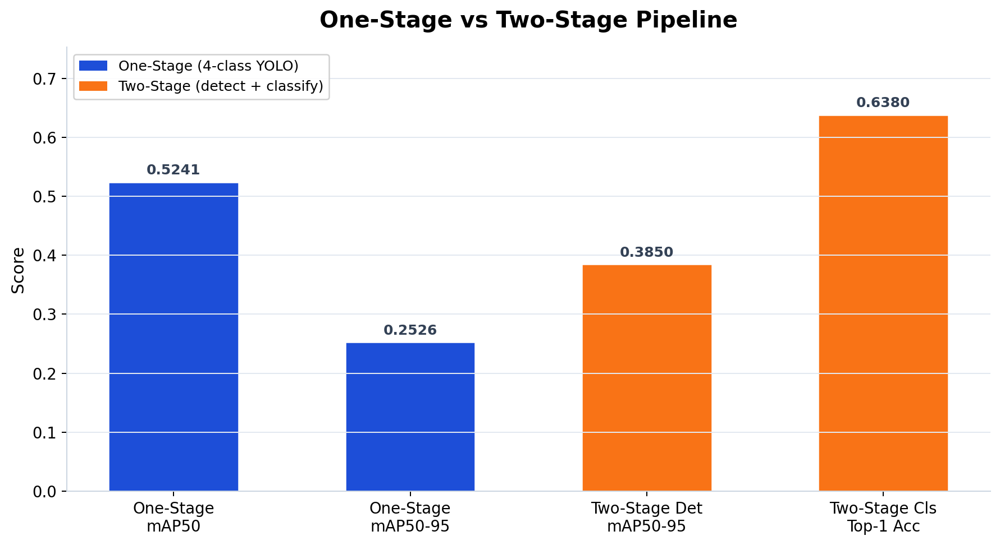
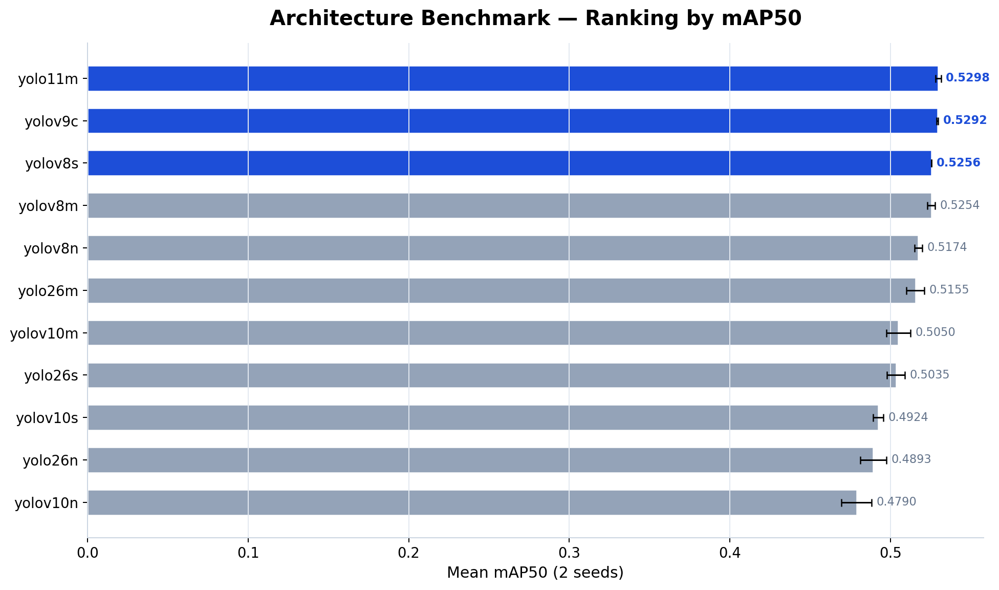

# Phase 1 Summary

Phase 1 menjawab dua pertanyaan besar: pipeline mana yang paling realistis untuk task 4-kelas ini (one-stage vs two-stage), dan arsitektur mana yang paling stabil di pipeline yang menang. Keduanya dijalankan dalam kondisi terkontrol — resolusi, batch, augmentation, dan seed sudah di-lock dari Phase 0.

Dasar keputusan resolusi dan dataset ada di [phase0_summary.md](../phase0/phase0_summary.md). Hasil tuning di [phase2_summary.md](../phase2/phase2_summary.md).

## Sumber data

- [one_stage_results.csv](one_stage_results.csv) — hasil one-stage baseline
- [two_stage_results.csv](two_stage_results.csv) — hasil two-stage per komponen
- [architecture_benchmark.csv](architecture_benchmark.csv) — benchmark 11 arsitektur
- [phase1b_top3.csv](phase1b_top3.csv) — top-3 model
- [locked_setup.yaml](locked_setup.yaml) — lock file Phase 1

## 1. Input dari Phase 0

Phase 1 membawa dua lock dari Phase 0:
- Resolusi kerja: **640**
- Dataset aktif: [Dataset-YOLO/data.yaml](../../Dataset-YOLO/data.yaml)

Semua perbandingan di Phase 1 menggunakan konfigurasi yang identik supaya hasilnya apple-to-apple.

## 2. Phase 1A — Keputusan pipeline

### One-stage baseline

Dari [one_stage_results.csv](one_stage_results.csv), one-stage detector (yolo11n, 4-class) menghasilkan:

- Mean mAP50: **0.5241**
- Mean mAP50-95: **0.2526**
- Variance antar seed sangat kecil (±0.001)

### Two-stage feasibility

Dari [two_stage_results.csv](two_stage_results.csv), pipeline two-stage terdiri dari:

- **Stage-1**: single-class detector (mendeteksi "buah sawit" tanpa membedakan kelas) → mean mAP50-95: **0.3850**
- **Stage-2**: classifier pada ground-truth crops → mean top-1 accuracy: **63.8%**

Penting: stage-2 diukur pada **ground-truth crops**, bukan prediksi stage-1. Artinya, 63.8% itu adalah *upper bound* — performa end-to-end pasti lebih rendah karena stage-1 tidak sempurna.

### Kenapa two-stage tidak dipilih

Alasan utama bukan karena angka overall two-stage lebih rendah — itu sudah expected karena pipeline lebih panjang. Alasan yang sebenarnya ada di **confusion matrix stage-2 classifier** pada GT crops:

| | Prediksi B2 | Prediksi B3 |
|---|---:|---:|
| Ground truth B2 | 211 (correct) | **94** (confused → B3) |
| Ground truth B3 | **334** (confused → B2) | 1,112 (correct) |

Bahkan saat objek sudah dipotong sempurna menggunakan bounding box ground truth — menghilangkan semua noise dari background dan lokalisasi — classifier masih salah mengklasifikasikan B2 sebagai B3 pada **31% kasus** (94 dari 305). Lebih parah lagi, B3 salah jadi B2 pada 23% kasus (334 dari 1,446).

Ini adalah temuan yang krusial. Kalau classifier tidak bisa membedakan B2 dan B3 bahkan pada kondisi ideal (GT crops), menambahkan complexity dua pipeline tidak akan menyelesaikan masalah fundamental ini. One-stage detector yang langsung mengoptimasi 4-class detection setidaknya bisa memanfaatkan konteks spasial (posisi relatif dalam tandan, ukuran relatif antar buah) yang hilang saat objek dipotong menjadi crop individual.

> **Keputusan: pipeline `one-stage`.**

## 3. Phase 1B — Benchmark arsitektur

Setelah pipeline di-lock, 11 arsitektur YOLO di-benchmark dalam kondisi identik: resolusi 640, `lr0=0.001`, `batch=16`, augmentasi medium, 2 seed per model.

### Ranking lengkap

### Top-3

Dari [phase1b_top3.csv](phase1b_top3.csv):

| Rank | Model | Mean mAP50 | Mean mAP50-95 | Mean B4 Recall |
|---:|---|---:|---:|---:|
| 1 | `yolo11m.pt` | 0.5298 | 0.2570 | 0.367 |
| 2 | `yolov9c.pt` | 0.5292 | 0.2518 | 0.352 |
| 3 | `yolov8s.pt` | 0.5256 | 0.2521 | 0.411 |

Ada beberapa hal menarik dari benchmark ini:

**Gap antar model teratas sangat kecil.** Selisih yolo11m dan yolov9c hanya 0.0006 mAP50 — nyaris dalam margin of error. Ini menandakan bahwa di task dan dataset ini, bottleneck performa bukan di pilihan arsitektur model, tapi di task difficulty dan data quality itu sendiri. Ganti model family dari YOLOv8 ke YOLO11 ke YOLOv9 tidak menghasilkan lompatan performa.

**yolov8s punya B4 recall tertinggi** (0.411) meskipun overall mAP50-nya lebih rendah. Ini menarik — model yang lebih kecil (s-variant) kadang lebih baik mendeteksi objek kecil karena feature map-nya tidak terlalu ter-downsample. Tapi keunggulan ini tidak cukup untuk mengimbangi kelemahannya di kelas lain.

**Model-model besar belum tentu lebih baik.** yolov10m (0.505) dan yolo26m (0.516) kalah dari yolov8s (0.526). Ini lagi-lagi menunjukkan bahwa capacity model bukan bottleneck — data dan task yang membatasi.

### Gate canonical dan override

Dari [locked_setup.yaml](locked_setup.yaml):
- Gate canonical `mAP50 >= 0.70`: **False** — tidak ada model yang melewati threshold ini
- Local override continue: **True**

Secara protokol E0, fase ini seharusnya berhenti karena gate tidak lolos. Tapi repo ini menggunakan override operasional agar pipeline end-to-end tetap berjalan sampai Phase 3 — keputusan ini disengaja untuk menghasilkan satu baseline lengkap yang bisa dijadikan referensi, meskipun performanya belum ideal.

## 4. Model yang di-lock

Model yang di-lock ke Phase 2: **`yolo11m.pt`**.

Lock ini artinya Phase 2 tidak membuka architecture search baru — hanya melakukan hyperparameter tuning pada satu model yang sudah dipilih.

Bukti resmi:
- [phase1b_top3.csv](phase1b_top3.csv)
- [locked_setup.yaml](locked_setup.yaml)

## 5. Keputusan akhir Phase 1

Phase 1 menghasilkan dua keputusan yang dibawa ke fase selanjutnya:

1. **Pipeline: `one-stage`** — two-stage gagal menunjukkan keunggulan, bahkan di kondisi ideal (GT crops)
2. **Model: `yolo11m.pt`** — menang tipis tapi konsisten, dan menunjukkan bahwa bottleneck bukan di arsitektur

## 6. Langkah berikutnya

Setelah pipeline dan model di-lock, eksperimen lanjut ke Phase 2 untuk menjawab pertanyaan: apakah tuning hyperparameter bisa mendorong performa melewati ceiling yang terlihat di Phase 1? Buka [phase2_summary.md](../phase2/phase2_summary.md).
