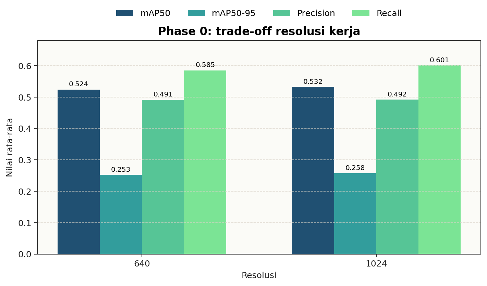
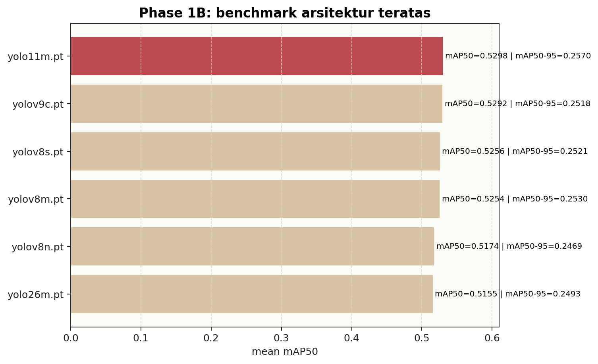
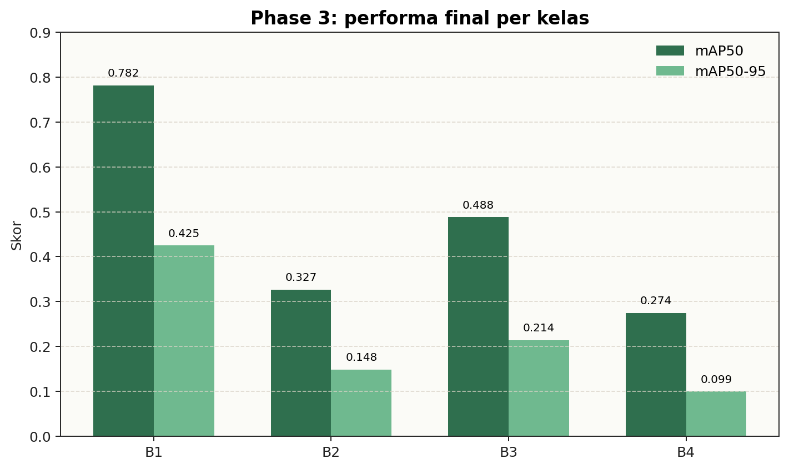
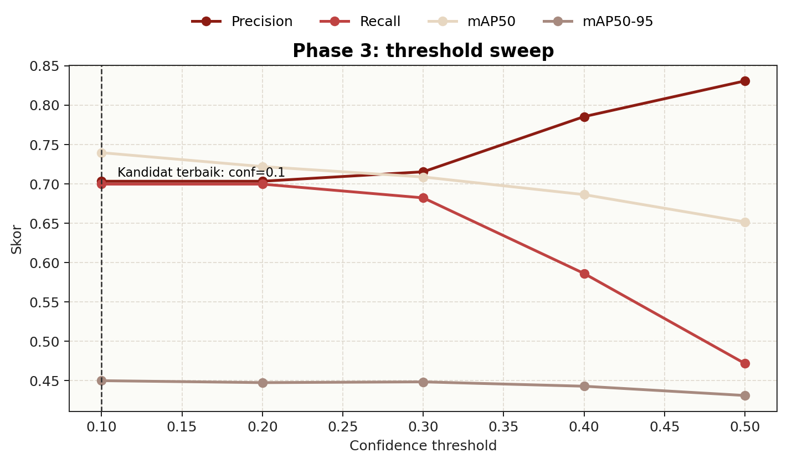

# Final Report - E0 End-to-End

Dokumen ini merangkum keputusan akhir eksperimen E0 dari **Phase 0** sampai **Phase 3**. Anggap dokumen ini sebagai peta keputusan: pembaca baru bisa cepat menangkap konteks, sementara pembaca teknis tetap bisa menelusuri artefak sumber tanpa kehilangan detail. Kalau baru membuka repo ini, mulai dari [README.md](../../README.md). Untuk langsung melihat metrik teknis run final, buka [outputs/phase3/final_evaluation.md](final_evaluation.md).

## Navigasi

Langsung ke yang kamu butuhkan:

- Gambaran besar repo: [README.md](../../README.md)
- Protokol canonical: [E0.md](../../E0.md)
- Cara menjalankan repo: [GUIDE.md](../../GUIDE.md)
- Summary tiap fase: [Phase 0](../phase0/phase0_summary.md) → [Phase 1](../phase1/phase1_summary.md) → [Phase 2](../phase2/phase2_summary.md)
- Hasil teknis final: [final_evaluation.md](final_evaluation.md)
- Cara reproduksi: [reproducibility_and_termination.md](../reports/reproducibility_and_termination.md)

Semua link di atas mengarah ke bukti detail — dokumen ini hanya rangkuman keputusannya saja.

## 1. Dokumen acuan

Sebelum lanjut, kita perlu sepakat source of truth-nya. Kalau ada ringkasan lain yang berbeda, file-file inilah yang jadi acuan resmi:

- [outputs/phase1/locked_setup.yaml](../phase1/locked_setup.yaml)
- [outputs/phase2/final_hparams.yaml](../phase2/final_hparams.yaml)
- [p3_final_yolo11m_640_s42_e60p15m60_eval.json](outputs/phase3/p3_final_yolo11m_640_s42_e60p15m60_eval.json)
- [p3_final_yolo11m_640_s42_e60p15m60_summary.json](outputs/phase3/p3_final_yolo11m_640_s42_e60p15m60_summary.json)
- [best.pt](../../runs/detect/runs/e0/p3_final_yolo11m_640_s42_e60p15m60/weights/best.pt)

## 2. Keputusan akhir

Ini bukan preferensi sementara — konfigurasi ini dikunci dan dipakai sampai run final:

| Komponen | Keputusan |
|----------|-----------|
| Pipeline | `one-stage` |
| Model | `yolo11m.pt` |
| Resolusi | `640` |
| Recipe | `lr0=0.001`, `batch=16`, `imbalance=none`, `ordinal=standard`, `aug=medium` |
| Run final | `p3_final_yolo11m_640_s42_e60p15m60` |
| Weight | [best.pt](../../runs/detect/runs/e0/p3_final_yolo11m_640_s42_e60p15m60/weights/best.pt) |

Titik akhirnya jelas: repo ini stop di satu setup yang bisa direproduksi ulang, bukan berhenti di ruang eksplorasi yang berantakan.

## 3. Narasi keputusan per fase

Angka akhir tidak muncul tiba-tiba. Setiap fase menjawab pertanyaan yang berbeda: apakah data cukup sehat, pipeline mana yang paling realistis, model mana yang paling stabil, dan apakah tuning benar-benar memberi alasan untuk mengubah baseline.

### Phase 0 — Dataset siap, resolusi 640

Fase ini ngecek dua hal fundamental: apakah dataset kita cukup bersih buat baseline, dan resolusi kerja mana yang paling masuk akal.

Hasilnya, dataset lolos audit dasar tanpa blocker teknis. Detailnya di [dataset_audit.json](../phase0/dataset_audit.json) dan [eda_report.md](../phase0/eda_report.md).

Resolution sweep (lihat [resolution_sweep.csv](../phase0/resolution_sweep.csv)) nunjukin `1024` memang sedikit lebih baik dari `640`, tapi selisihnya nggak sebanding dengan biaya eksperimen yang lebih berat. Karena itu, kita lock **640** sebagai resolusi kerja. Ringkasannya di [phase0_summary.md](../phase0/phase0_summary.md).

Kenaikan ke 1024 ada, tapi kecil. Keputusan 640 memang kelihatan konservatif, tapi justru itu yang bikin baseline tetap efisien dan konsisten buat fase-fase selanjutnya.

### Phase 1A — Pilih pipeline one-stage

Fase ini bandingin dua pendekatan: tetap pakai satu detector sederhana, atau pecah jadi dua tahap. Hasil perbandingan ada di [one_stage_results.csv](../phase1/one_stage_results.csv) dan [two_stage_results.csv](../phase1/two_stage_results.csv).

Kita milih **`one-stage`**. Bukannya two-stage nggak bisa belajar, tapi classifier-nya masih confusion `B2/B3` parah, bahkan di GT crops. Ringkasannya di [phase1_summary.md](../phase1/phase1_summary.md).

Masalah utamanya bukan akurasi detector, tapi ketidakstabilan klasifikasi pas kelas berdekatan harus dipisah. Makanya fokus repo tetap tajam ke satu detector, nggak perlu nambah kompleksitas di classifier two-stage yang belum meyakinkan.

### Phase 1B - `yolo11m.pt` menang tipis dan di-lock

Phase 1B adalah fase seleksi model. Tujuannya bukan mencari model yang tampak bagus pada satu run, tetapi model yang tetap paling aman ketika dibandingkan secara langsung.

Benchmark arsitektur lengkap ada di [outputs/phase1/architecture_benchmark.csv](../phase1/architecture_benchmark.csv). Top-3 resminya ada di [outputs/phase1/phase1b_top3.csv](../phase1/phase1b_top3.csv).

Tiga model teratas:

| Rank | Model | mean mAP50 | mean mAP50-95 |
|---:|---|---:|---:|
| 1 | `yolo11m.pt` | 0.5298 | 0.2570 |
| 2 | `yolov9c.pt` | 0.5292 | 0.2518 |
| 3 | `yolov8s.pt` | 0.5256 | 0.2521 |

Gate canonical `mAP50 >= 0.70` memang tidak lolos. Namun repo ini memakai override operasional agar baseline end-to-end tetap selesai. Lock resminya tetap ada di [outputs/phase1/locked_setup.yaml](../phase1/locked_setup.yaml).

Visual pendukung: [outputs/phase3/figures/phase1_architecture_benchmark.png](figures/phase1_architecture_benchmark.png)

`yolo11m.pt` bukan menang telak — cuma menang tipis, tapi cukup buat di-lock sebagai yang paling stabil. Selisih antar model atas sempit banget, jadi bottleneck utama bukan lagi soal milih family model "ajaib", tapi batasan kualitas task dan data-nya sendiri.

### Phase 2 — Balik ke baseline stabil

Fase ini ngetes apakah tuning bisa ngalahin baseline Phase 1, atau cuma ngasih variasi kecil tanpa keuntungan jelas.

Hasil tuning dirangkum di [tuning_results.csv](../phase2/tuning_results.csv):

- `final_source = phase1_baseline_reverted`
- `reverted_to_phase1_baseline = True`

Artinya, tuning dilakukan, tapi hasilnya balik lagi ke recipe baseline yang paling stabil. Konfigurasi final buat Phase 3 ada di [final_hparams.yaml](../phase2/final_hparams.yaml), confirm run-nya di [p2confirm_yolo11m_640_s3_e30p10m30_eval.json](../phase2/p2confirm_yolo11m_640_s3_e30p10m30_eval.json).

Tuning tetap berguna buat nutup pertanyaan eksperimen, tapi hasilnya belum cukup kuat buat geser baseline yang udah stabil. Ini sinyal kalau ruang optimasi ringan udah kebanyakan dijelajahi — gain besar nggak bakal datang dari tweak recipe kecil.

### Phase 3 — Retrain final selesai, deploy ditunda

Fase terakhir — di sini baseline yang udah dipilih nggak lagi diuji, tapi dijalanin ulang secara final buat hasilin bobot, evaluasi, dan status deploy resmi.

Dokumentasi run final:

- [p3_final_yolo11m_640_s42_e60p15m60_summary.json](p3_final_yolo11m_640_s42_e60p15m60_summary.json)
- [p3_final_yolo11m_640_s42_e60p15m60_eval.json](p3_final_yolo11m_640_s42_e60p15m60_eval.json)

Phase 3 nyelesaiin final retrain, evaluasi test set, threshold sweep, dan error review. Weight final udah diamankan. Tapi status deploy tetap **deferred**, sesuai [deploy_check.md](deploy_check.md).

Dari sisi eksperimen, fase ini selesai rapi. Tapi operasionalnya, kita masih tahan deploy soalnya kualitas antar kelas belum merata. Baseline final udah ada dan bisa direproduksi, tapi "selesai eksperimen" itu beda sama "siap dipakai".

## 4. Hasil akhir resmi

Angka ini yang dipakai kalau ada yang nanya performa final repo. Prioritaskan file run-specific ini:

- [p3_final_yolo11m_640_s42_e60p15m60_eval.json](p3_final_yolo11m_640_s42_e60p15m60_eval.json)
- [p3_final_yolo11m_640_s42_e60p15m60_summary.json](p3_final_yolo11m_640_s42_e60p15m60_summary.json)

| Metrik resmi test set | Nilai |
|---|---:|
| Precision | 0.4763 |
| Recall | 0.5538 |
| mAP50 | 0.4677 |
| mAP50-95 | 0.2215 |
| All classes `AP50 >= 0.70` | False |

Per-class highlights:

- `B1` paling kuat (`mAP50 = 0.7821`)
- `B3` berada di tengah (`mAP50 = 0.4880`)
- `B2` masih lemah (`mAP50 = 0.3266`)
- `B4` paling sulit (`mAP50 = 0.2742`)

Visual pendukung: [outputs/phase3/figures/phase3_per_class_ap.png](figures/phase3_per_class_ap.png)

Performa final nggak runtuh total, tapi jelas nggak seimbang. `B1` udah kuat, `B3` masih menengah, sementara `B2` dan apalagi `B4` masih jadi sumber kelemahan utama.

Model ini cukup jadi baseline final yang jujur, tapi belum cukup aman kalau targetnya performa rata di semua kelas.

## 5. Threshold, error, dan status deploy

Bagian ini nerjemahin metrik jadi implikasi operasional — threshold mana yang masuk akal, error apa yang sering muncul, dan kenapa deploy masih ditunda.

Threshold operasi dari [threshold_sweep.csv](threshold_sweep.csv). Kandidat terbaik ada di **`conf=0.1`**.

Analisis error ada di [error_analysis.md](error_analysis.md) dan [error_stratification.csv](error_stratification.csv). Pola error dominan tetap sama kayak fase sebelumnya:

- `false_positive`
- confusion `B2/B3`
- `B4_missed`
- confusion `B3/B4`

Status deploy tetap **deferred**. Keluaran utama sesi ini:

- weight final `.pt`
- laporan akhir
- evaluasi final
- recipe final yang bisa direproduksi

Threshold rendah di `conf=0.1` nunjukin kalo menjaga recall masih penting, tapi pola error buktiin masalah inti belum selesai cuma dengan geser threshold. Makanya deploy **deferred** masih masuk akal — kalo dipaksakan sekarang, risiko noise prediksi dan miss di kelas sulit masih terlalu nyata.

## 6. Kesimpulan

Eksperimen E0 ngasilin **satu baseline final yang konsisten dan terdokumentasi**, tapi model yang kuat merata di semua kelas belum tercapai.

Kesimpulan yang paling bisa diandelin:

1. dataset aktif cukup layak buat baseline
2. `640` adalah resolusi kerja yang paling realistis
3. `one-stage` adalah pipeline yang paling masuk akal
4. `yolo11m.pt` adalah model terbaik yang lolos sampai akhir
5. tuning Phase 2 nggak ngasih alasan kuat buat ninggalin baseline stabil
6. bottleneck utama tetep di `B2/B3`, `B4`, dan error deteksi berlebih

**Langkah berikutnya:** nggak usah sweep kecil-kecil generik lagi. Prioritas yang lebih masuk akal adalah kerjaan yang langsung nyentuh `B2/B3`, `B4`, kualitas label, dan formulasi task-nya.

## 7. Lanjut baca apa

Jalur efisien dari ringkasan ke bukti teknis lebih rinci:

- [final_evaluation.md](final_evaluation.md)
- [error_analysis.md](error_analysis.md)
- [threshold_sweep.csv](threshold_sweep.csv)
- [final_hparams.yaml](../phase2/final_hparams.yaml)
- [reproducibility_and_termination.md](../reports/reproducibility_and_termination.md)

**Urutan baca:** mulai dari evaluasi final, turun ke error analysis dan threshold sweep, baru ke recipe dan catatan reproduksi.
